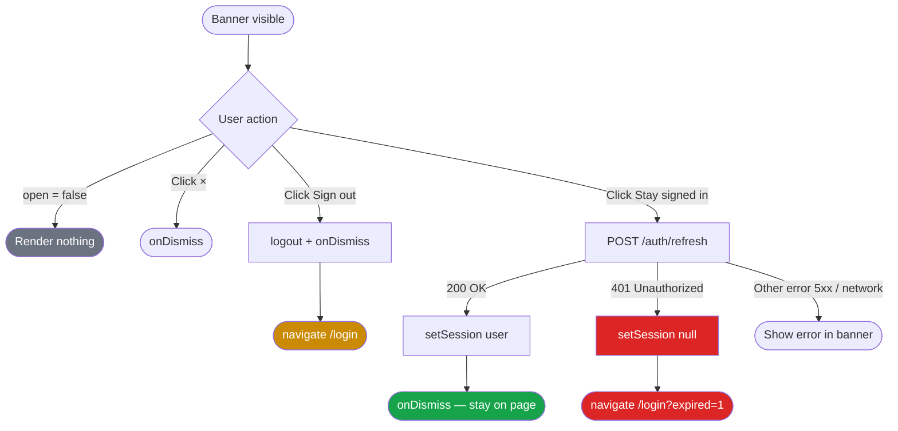

# SessionExpiringBanner — Test Documentation

## Overview

`SessionExpiringBanner.test.jsx` validates the session-expiry warning banner, with emphasis on the bug fix that ensures users are redirected to the login page when their session has already expired on the server.

### The bug (before fix)

`/api/auth/refresh` is intentionally excluded from the global `sessionInvalidHandler` in `api.js` to prevent redirect loops. This meant a 401 from the refresh endpoint was only caught in the banner's `catch` block, which displayed an error string and did nothing else — the user saw "Session timed out due to inactivity" in the banner but was never redirected.

### The fix

`onStaySignedIn` now checks the HTTP status of a failed refresh. A 401 means the server session is already gone: local state is cleared via `setSession(null)` and the user is redirected to `/login?expired=1`. Non-401 failures (network errors, 5xx) fall through to the existing error-message path.

---

## Flow Diagram



---

## Test Scenarios

### Scenario 1 — Refresh succeeds (regression check)

**Trigger:** User clicks "Stay signed in" while their session is still valid on the server.

**Mocked response:** `POST /auth/refresh` resolves with `{ user: { id, email } }`.

**Assertions:**
- `setSession(user)` called with the refreshed user object
- `onDismiss` called once (parent controls banner visibility)
- `navigate` not called — user stays on the current page

---

### Scenario 2 — Refresh returns 401 (core fix)

**Trigger:** User clicks "Stay signed in" but their session already expired on the server.

**Mocked response:** `POST /auth/refresh` rejects with `{ response: { status: 401 } }`.

**Assertions:**
- `setSession(null)` called — local auth state cleared
- `navigate("/login?expired=1", { replace: true })` called
- No error text rendered in the banner (redirect takes over)

This is the primary scenario the fix addresses.

---

### Scenario 3 — Non-401 refresh failure (error display)

**Trigger:** User clicks "Stay signed in" and the server returns a 500 or a network error occurs.

**Mocked response:** `POST /auth/refresh` rejects with `{ response: { status: 500 } }`.

**Assertions:**
- "Could not refresh your session" error message appears in the banner
- `navigate` not called — user remains on the page
- `setSession` not called — auth state unchanged

---

### Scenario 4 — Sign out button

**Trigger:** User clicks "Sign out".

**Assertions:**
- `logout()` called once
- `onDismiss` called once
- `navigate("/login", { replace: true })` called
- URL does **not** contain `?expired=1` (voluntary sign-out vs. forced expiry)

---

### Scenario 5 — Banner hidden when closed

**Trigger:** Component rendered with `open={false}`.

**Assertion:** Container renders no DOM nodes (early `return null`).

---

## Mocking Strategy

| Dependency | Mock | Reason |
|---|---|---|
| `react-router-dom` | `useNavigate → vi.fn()` | Capture navigation calls without a real router |
| `../auth.jsx` | `useAuth → { setSession, logout }` | Isolate auth state mutations |
| `../api.js` | `api.post → vi.fn()` | Control refresh responses per test |
| `../apiError.js` | `getApiErrorMessage → returns fallback` | Deterministic error strings |

`vi.clearAllMocks()` runs before each test to prevent cross-test contamination.

---

## Running the Tests

```bash
# From the client directory
npx vitest run src/components/SessionExpiringBanner.test.jsx

# Watch mode during development
npx vitest src/components/SessionExpiringBanner.test.jsx
```
