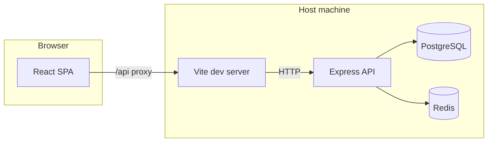

# Expense Tracker — Architecture & Design

This document describes how the application is structured, how major components interact, and the main design choices.

**Diagrams (apps, integrations, data):** see [**ARCHITECTURE_DIAGRAM.md**](./ARCHITECTURE_DIAGRAM.md) for Mermaid figures: system context, PM2 vs manual dev, server modules, client → API map, ER model, JWT auth sequence, and **OAuth SSO redirect sequence**.

## High-level overview

The system is a **classic three-tier setup** for local development:

- **Client:** Vite + React SPA, styled with Tailwind, routing via React Router, HTTP via Axios.  
- **Server:** Node.js **Express** REST API, **JWT** bearer authentication, **node-postgres** (`pg`) for SQL, **ioredis** for optional caching.  
- **Infrastructure (local):** Docker Compose provides **PostgreSQL** and **Redis**; the API and SPA are started with **npm** (not containerized in the default compose file).

---

## Repository layout

| Path | Role |
|------|------|
| `client/` | Frontend SPA (Vite, React, Tailwind). |
| `server/` | Backend API (Express, ESM `"type": "module"`). |
| `docker-compose.yml` | Postgres + Redis for local dev. |
| `docs/` | User and architecture documentation. |

---

## Client architecture

### Stack

- **React 18** with function components.  
- **React Router v6** — public routes (`/login`, `/register`, **`/oauth/callback`** for SSO return) vs private shell (`/`, `/expenses`, `/expenses/list`, `/reports`). **Post-login landing:** `GET /api/expenses?limit=1` — if any row exists, navigate to **`/expenses/list`**; otherwise **`/expenses`** (same for `/` index, login/register success, OAuth success, and already-authed visits to `/login`).  
- **Tailwind CSS** — utility-first styling, dark theme.  
- **Axios** — single instance with `baseURL: "/api"`; **`FormData`** uploads omit `Content-Type` so the browser sets the multipart boundary.  
- **Recharts** — bar charts on the Reports page.  

### Auth flow

- Tokens and user profile fragments are stored in **`localStorage`** (`authStorage.js` keys).  
- An Axios **request interceptor** (`api.js`) attaches `Authorization: Bearer <token>` on **every** request from the current `localStorage` value. That avoids a race where child components fired API calls before a `useEffect` could set default headers (see historical “Missing token” issue).  
- **`AuthProvider`** (`auth.jsx`) exposes session state (`setSession`, `logout`) to the tree.  
- **Protected routes** wrap the main layout in a guard that redirects unauthenticated users to `/login`.  
- **SSO:** `SsoButtons` navigate the browser to `GET /api/auth/oauth/:provider` (proxied); the API redirects to the IdP, then to `GET /api/auth/oauth/:provider/callback`, exchanges the code, issues a JWT, and redirects the browser to **`/oauth/callback?token=…`** (or `?error=…`). **`OAuthCallbackPage`** stores the token and applies the same post-login landing as email/password.

### Dev proxy

- **`vite.config.js`** uses `loadEnv` so **`API_PROXY_TARGET`** (from `client/.env`) can point the `/api` proxy at the correct host/port (e.g. when the API is not on 4000).  

### Domain helpers

- **`expenseOptions.js`** — canonical option lists and display formatters for **category**, **frequency**, and **financial institution**, keeping labels aligned with server-accepted values.

### Pages

- **`LoginPage` / `RegisterPage`** — email/password auth forms; **`SsoButtons`** (Google, GitHub, GitLab, Microsoft) when OAuth is configured on the server; errors via **`apiError.js`** where used.  
- **`OAuthCallbackPage`** (`/oauth/callback`) — reads **`token`** or **`error`** from the query string after the API redirects back from **`GET /api/auth/oauth/:provider/callback`**; stores JWT and runs the same post-login landing as password flows.  
- **`ExpensesPage`** — **Import** title (nav label **Import**); onboarding (manual add + import) when there are no saved expenses; after that, import + optional collapsible manual add; link/nav to list page. **`YourExpensesPage`** (`/expenses/list`) — **Your expenses** table with modification mode for row edits; empty state links to **Import**. **Statement import** staging lives on **Import**, then commit.  
- **`ReportsPage`** — tabbed report types, fetches report endpoints, shows monthly summary list.  
- **`Layout`** — navigation and sign-out.

---

## Server architecture

### Entry and lifecycle

- **`index.js`** loads env (`dotenv`), runs **`ensureJwtSecret()`** (weak/missing `JWT_SECRET` → generate and persist to `server/.env`), **`initDb()`** (DDL + additive migrations), starts the **monthly summary cron**, then **`listen`** on `PORT`.  
- **CORS** allows `CLIENT_ORIGIN` or reflects open config in dev.

### Routing

| Mount | Responsibility |
|--------|----------------|
| `GET /health` | Liveness check (no auth). |
| `/api/auth` | `POST /register`, `POST /login` — bcrypt password hashing, JWT issuance; `GET /me` (JWT); **`GET /oauth/:provider`**, **`GET /oauth/:provider/callback`** — OAuth2 code flow for `google` / `github` / `gitlab` / `microsoft`, `findOrCreate` user + `oauth_identities`, JWT redirect to `CLIENT_ORIGIN/oauth/callback`. |
| `/api/expenses` | CRUD for expenses; **JWT required**. |
| `/api/imports` | Statement upload → **`import_batches`** + **`import_staging_rows`**; per-row **category** / **frequency**; **commit** inserts into `expenses` only where `category` is set; **JWT required**. |
| `/api/reports` | Aggregated spending endpoints + list of persisted summaries; **JWT required**. |

### Authentication

- **JWT** payload uses `sub` as the numeric user id (`middleware/auth.js`).  
- Protected handlers read **`req.userId`**.  
- **Password-only users** have `password_hash` set; **SSO-only users** may have `password_hash` null — login with password rejects those with a message to use SSO (`routes/auth.js`).  
- **OAuth** (`server/src/oauth/`): short-lived random `state` (CSRF), per-provider token exchange and profile fetch, **link or create** user by email / identity (`oauth_identities`).  
- Auth errors return **401** with JSON `{ error: ... }`; connectivity issues to Postgres return **503** with a clearer message where detected (`routes/auth.js`).

### Expenses domain

- **Validation** enforces **allow-lists** for category, `financial_institution`, and `frequency` (aligned with the client dropdowns).  
- Dates are stored as **`DATE`** (`spent_at`); amounts as **`NUMERIC`**.  
- List supports optional `from` / `to` query filters and pagination caps.  
- **Statement import:** **`multer`** + **`parseVisaStatement.js`** → staging tables; upload form sets **institution**, **frequency**, and optional **`payment_day`** (or derive from each line’s date). User assigns **category** (required to import), may adjust **frequency** / **`payment_day`** per row; **commit** writes only categorized rows to **`expenses`** (**`financial_institution`** from batch; **`frequency`** and **`payment_day`** from row). **`pdf-parse`** is loaded via subpath to avoid ESM debug harness.

### Reports

- Separate handlers for **daily**, **weekly**, **monthly**, **yearly**, and **custom range** queries; responses include **series** for charting and **totals**.  
- **Redis:** report payloads are cached with a short TTL (~2 minutes) when `REDIS_URL` is set; failures degrade to uncached DB queries.  

### Background job

- **`node-cron`** schedules a job (documented as **03:00 UTC on day 1** of each month) that aggregates **the previous calendar month** per user into **`monthly_summaries`**, upserting rows.  
- This is **decoupled** from interactive reporting (live reports always query `expenses`).

---

## Data model

### `users`

- `id`, `email` (unique), `password_hash` (nullable for SSO-only accounts), `created_at`.

### `oauth_identities`

- `user_id` → `users`, `provider` (`google` / `github` / `gitlab` / `microsoft`), `provider_user_id`, `email` snapshot; unique **`(provider, provider_user_id)`**.

### `expenses`

- `user_id` → `users`, `amount`, `category`, `financial_institution`, `frequency`, **`payment_day`** (optional day-of-month 1–30), `description`, `spent_at`, `created_at`.  
- Index **`(user_id, spent_at)`** for typical list and report filters.  
- Schema evolution uses **`CREATE TABLE IF NOT EXISTS`** plus **`ALTER TABLE … ADD COLUMN IF NOT EXISTS`** so existing databases upgrade on API startup.

### `monthly_summaries`

- `user_id`, `year`, `month`, `total`, `generated_at`, unique **`(user_id, year, month)`** for idempotent updates from the cron job.

### `import_batches` / `import_staging_rows`

- **`import_batches`:** `user_id`, `source_filename`, `default_financial_institution`, `default_frequency`. A new upload **deletes** prior batches for that user (cascade removes old staging rows).  
- **`import_staging_rows`:** `batch_id`, `spent_at`, `amount`, `description`, **`category` nullable** (required before commit), **`frequency`**, **`payment_day`** (1–30; seeded from posting date). **`PATCH /api/imports/rows/:id`** updates **`category`**, **`frequency`**, and/or **`payment_day`**.

---

## Cross-cutting design decisions

1. **JWT stateless sessions** — no server-side session store; scale-out friendly at the cost of no instant server-side revocation without extras (e.g. blocklist).  
2. **Allow-lists on the API** — prevents arbitrary strings for enum-like fields even if the UI is bypassed.  
3. **Additive DB migrations in `initDb`** — simple for a small app; larger teams might move to explicit migration tooling.  
4. **Frequency as metadata** — stored for user clarity; **reporting** is driven by `spent_at`, not by projecting recurring expenses into future periods.  
5. **Redis optional** — correct behavior without Redis; with Redis, repeated report reads are cheaper.  
6. **OAuth optional** — each provider is enabled only when its `OAUTH_*` client id/secret pair is set; unconfigured providers return **503** on `GET /oauth/:provider`. Identity linking uses **`oauth_identities`** plus email match for existing **`users`** rows.

---

## Related files (quick reference)

| Concern | Location |
|---------|-----------|
| DB bootstrap | `server/src/db.js` |
| JWT bootstrap | `server/src/ensureJwtSecret.js` |
| Auth routes | `server/src/routes/auth.js` |
| OAuth (SSO) | `server/src/oauth/oauthRoutes.js`, `oauthService.js`, `oauthState.js` |
| Expense routes | `server/src/routes/expenses.js` |
| Import staging + commit | `server/src/routes/imports.js` |
| Category / institution enums | `server/src/expenseEnums.js` |
| Statement parsing | `server/src/parsers/visaStatement.js` |
| Report routes + cache | `server/src/routes/reports.js`, `server/src/redis.js` |
| Monthly job | `server/src/jobs/monthlySummary.js` |
| Client API + token | `client/src/api.js`, `client/src/authStorage.js` |
| SSO UI | `client/src/components/SsoButtons.jsx`, `client/src/pages/OAuthCallbackPage.jsx` |
| Expense enums / labels | `client/src/expenseOptions.js` |

For day-to-day usage, see [USER_GUIDE.md](./USER_GUIDE.md).
