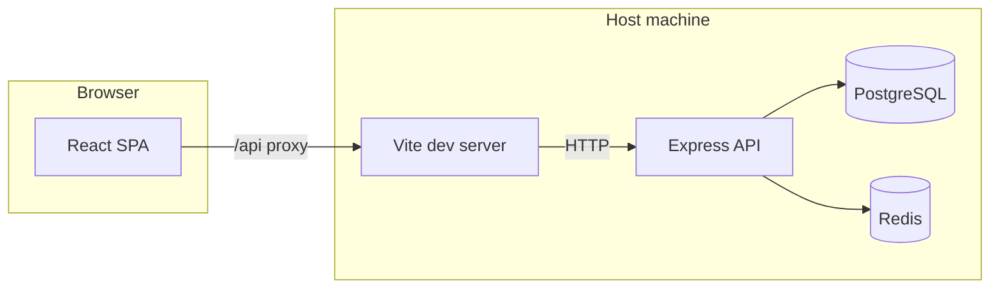

# Expense Tracker — Architecture and design

This document describes how the application is structured, how major components interact, and the main design choices.

**Renewals:** See [**RENEWALS.md**](./RENEWALS.md) for the **Renewal** expense category, **`renewal_kind`**, **`/renewals`** page, combined **Projection** (**Active** rows only; **`cancel`** excluded), and import staging behavior.

**Prescriptions:** See [**PRESCRIPTIONS.md**](./PRESCRIPTIONS.md) for **`/prescriptions`**, the **`prescriptions`** table (**`renewal_period`** — **1–11 months** in monthly steps, then **1–5 years** — and **`next_renewal_date`**), **`prescriptionEnums.js`**, and **30-day in-app reminders** (**`PrescriptionReminders`**).

**Diagrams:** See [**ARCHITECTURE_DIAGRAM.md**](./ARCHITECTURE_DIAGRAM.md) for figures that illustrate: the system context (section 1), the topology from local development through a production deployment (section 1b), running processes with manual `npm` commands or PM2 during development, server modules (including **`expenseEnums.js`** and **`recoveryCodeStorage.js`** wired from **`/api/expenses`**, **`/api/imports`**, **`/api/backup`**), how client pages map to API routes (**including `RenewalsPage`**, **`PrescriptionsPage`**, **`YourExpensesPage` list vs. renewal filter**, backup on **Profile**, and a compact expense/import flow), **Layout** shell navigation (**Import**; **Lists** ▾ on small viewports or **Expenses** / **Renewals** / **Prescriptions** / **Reports** as links from **`lg`** up), **renewal reminder tiers** (client-only math and day bands; **UI on all authenticated shell routes** via **`Layout`**, grouped by institution with a **numeric badge** beside the avatar that toggles table visibility and an **account menu** entry to restore the panel when all rows are dismissed), **Renewals vs. Expenses list vs. Upcoming renewals**, **import pipeline** (renewal branch), **backup export/restore**, the entity-relationship model (**`expenses.website`**, **`renewal_kind`**, staging columns), authenticated request sequences (including **filtered** `GET /expenses?category=renewal`), and the OAuth single sign-on redirect sequence. Narrative docs for **Docker Compose production**, **password recovery**, and **backup/restore** are in [USER_GUIDE.md](./USER_GUIDE.md) and [deployment/docker-compose/README.md](../deployment/docker-compose/README.md).

## High-level overview

The diagram in this section describes **local development**. When you are ready to ship: you run the Vite **production build**, serve the generated **`dist/`** directory as static files, and run the API behind **Transport Layer Security** and a **reverse proxy** (or on a separate host). See [**From development to production**](#from-development-to-production) and [Architecture diagrams, section 1b](./ARCHITECTURE_DIAGRAM.md#1b-from-development-to-production-topology).

During local development, the system follows a **three-tier** pattern:

- **Client:** The Vite development server serves a **React** single-page application, styled with Tailwind, with routes handled by React Router and HTTP calls made with Axios.  
- **Server:** A **Node.js** **Express** Representational State Transfer API, **JSON Web Token** bearer authentication, the **node-postgres** library (`pg`) for SQL, and **ioredis** for optional caching.  
- **Infrastructure (local):** Docker Compose can provide **PostgreSQL** and **Redis**. The API and single-page application are started with **npm** scripts; the default `docker-compose.yml` does not containerize those Node processes.

---

## From development to production

The lifecycle is **development first**, **production second**: you run and test on your machine, **then** build and deploy the same codebase to a hosted environment.

### Development (local)

- **Frontend:** The **Vite development server** runs the `vite` command and listens on a port such as **5173**. It serves source files with **Hot Module Replacement** (updates in the editor refresh parts of the page without a full reload) and **proxies** requests whose path begins with **`/api`** to the Express API.  
- **API:** **Express** listens on the port given by the `PORT` environment variable (for example **4000**). It is reachable through the Vite proxy or by calling the API host and port directly.  
- **Single-page application to API:** The browser treats the Vite origin (for example `http://localhost:5173`) as the **same origin** for JavaScript. Requests to **`/api`** are forwarded by Vite to the URL in **`API_PROXY_TARGET`** inside `client/.env`.  
- **PostgreSQL:** Runs locally or via Docker Compose. **Redis** is optional and used to cache report responses.  
- **Configuration:** Environment variables live in `server/.env` and `client/.env`.  
- **OAuth:** **`CLIENT_ORIGIN`** is typically `http://localhost:5173` during development. Identity-provider redirect URLs must match that origin.

### Production (deployed)

- **Build step:** Change into the `client` directory and run **`npm run build`**. That command runs the production build (Vite `build`) and writes static files—HTML, JavaScript, and CSS—into **`client/dist/`**. **Do not** run the Vite **development** server for end users. Serve only the contents of **`dist/`** from a static file server.  
- **Frontend hosting:** Use **nginx**, **Caddy**, a cloud object store with a content delivery network, a platform-as-a-service static host, or similar.  
- **API:** The same **Express** application, typically behind **Transport Layer Security**, a **process manager** (systemd, PM2, Docker), or **orchestration** software.  
- **Single-page application to API:** Often **one public origin** where the edge server routes `/` to static files and `/api` to Node.js, so the built client can keep `baseURL: "/api"`. Alternatively, **two origins** (separate URLs for the static site and the API) with **Cross-Origin Resource Sharing** configured on Express.  
- **Health checks:** **`GET /health`** on the API returns JSON `{ ok: true }`. In **`deployment/docker`**, nginx proxies **`GET /health`** at the same public origin so monitors can hit the edge without a separate API port mapping.  
- **PostgreSQL and Redis:** Managed services or hardened self-hosted instances; backups; **secrets** supplied through environment variables or a secret manager (never commit production secrets to the repository).  
- **OAuth:** **`CLIENT_ORIGIN`** and identity-provider redirect URLs use your public **HTTPS** application URL (scheme, host, and port must match what users type).

**Summary:** During **development**, you run Vite, Express, PostgreSQL, and optionally Redis. **After that**, in **production**, you serve the static bundle produced by **`npm run build`**, run Express with PostgreSQL and optional Redis, terminate **HTTPS** at the edge, and route paths for `/` versus `/api` accordingly.

**Container deployment:** The repository includes **`deployment/docker-compose/`** for a full stack on one host (Postgres, Redis, API, nginx serving **`dist/`** with **`/api`** and **`/health`** proxies; persistent volumes for data, Redis append-only file, and API uploads). From the repo root, **`npm run compose:prod`** runs **`node deployment/docker-compose/ensure-env.mjs`** (creates **`.env`** and a random **`JWT_SECRET`** when needed), then **`docker compose … up -d --build`** with **`--env-file deployment/docker-compose/.env`**. The **api** service uses **`env_file: .env`** beside the Compose file so **`JWT_SECRET`** and **`CLIENT_ORIGIN`** reach the container without being overridden by empty **`${VAR}`** substitution. See [deployment/docker-compose/README.md](../deployment/docker-compose/README.md). **`deployment/kubernetes/`** targets a cluster; see [deployment/README.md](../deployment/README.md).

---

## Repository layout

| Path | Role |
|------|------|
| `client/` | Frontend single-page application (Vite, React, Tailwind). |
| `server/` | Backend API (Express, ECMAScript modules via `"type": "module"` in `package.json`). |
| `docker-compose.yml` | PostgreSQL and Redis for local development. |
| `docs/` | User-facing and architecture documentation. |
| `deployment/` | Dockerfiles, production Docker Compose stack, and Kubernetes manifests. |
| Root `package.json` | Optional scripts: **`npm run compose:prod`** (runs **`ensure-env.mjs`** then Compose **up**), **`npm run compose:ensure-env`**, **`compose:prod:down`**, **`compose:prod:logs`**, **`compose:prod:ps`**. |

---

## Client architecture

### Stack

- **React 18** with function components.  
- **React Router version 6** — Public routes include `/login`, `/register`, **`/recover`** (password reset with a saved recovery code; no email is sent), and **`/oauth/callback`** (return URL after single sign-on). Authenticated users use a private shell with routes such as `/`, `/expenses`, `/expenses/list`, **`/renewals`**, **`/prescriptions`**, `/reports`, and **`/profile`**. The **`Layout`** header lists **Import** and the four list routes: below the **`lg`** breakpoint they sit under a **Lists** dropdown; at **`lg`** and up they appear as **NavLink**s (**Expenses**, **Renewals**, **Prescriptions**, **Reports** in that order). **Profile** and **Sign out** are only in the **avatar account menu** (not a top-level tab). **Post-login navigation:** the app calls `GET /api/expenses?limit=1`. If at least one expense exists, the user is sent to **`/expenses/list`**; otherwise to **`/expenses`**. The same rule applies for the index route `/`, successful login or registration, successful OAuth, and visits to `/login` while already signed in.  
- **Tailwind CSS** — Utility-first styling with a dark theme.  
- **Axios** — A single HTTP client instance with `baseURL: "/api"`. **`FormData`** uploads omit the `Content-Type` header so the browser sets the multipart boundary automatically.  
- **Recharts** — Bar charts on the Reports page.  

### Authentication flow

- Tokens and user profile fragments are stored in the browser’s **`localStorage`** (keys defined in `authStorage.js`).  
- An Axios **request interceptor** in `api.js` adds `Authorization: Bearer <token>` to **every** request, reading the current token from `localStorage`. That avoids a race where child components issued API calls before a `useEffect` could set default headers (a historical “Missing token” issue).  
- A **response interceptor** in `api.js` detects **401** responses whose JSON **`error`** is **`Invalid token`** (for example an **expired** JWT) on protected routes, then notifies **`AuthProvider`** once so the user can choose **Continue session** (see **`SessionExpiredModal.jsx`** and **`POST /api/auth/refresh`**). Login, register, recover-password, and refresh requests are excluded from this hook to avoid loops.  
- **`AuthProvider`** in `auth.jsx` exposes session state (`setSession`, `logout`) to the component tree and renders **`SessionExpiredModal`** when an expired token is detected.  
- **Protected routes** wrap the main layout and redirect unauthenticated users to `/login`.  
- **Single sign-on:** **`SsoButtons`** send the browser to `GET /api/auth/oauth/:provider` (proxied to Express). The API redirects to the identity provider, then handles `GET /api/auth/oauth/:provider/callback`, exchanges the authorization code, issues a JSON Web Token, and redirects the browser to **`/oauth/callback?token=…`** or **`/oauth/callback?error=…`**. **`OAuthCallbackPage`** stores the token and uses the same post-login navigation as email-and-password flows.

### Development-only proxy

- **`vite.config.js`** uses `loadEnv` so **`API_PROXY_TARGET`** from `client/.env` can point the `/api` proxy at the correct host and port (for example when the API does not use port 4000).  
- This proxy runs **only during development**. After **`npm run build`**, static hosting does not run Vite. See [From development to production](#from-development-to-production).

### Domain helpers

- **`expenseOptions.js`** — Canonical option lists and display formatters for **category** (including **Renewal**), **`RENEWAL_KIND_OPTIONS`** / **`formatRenewalKind`**, **frequency**, **financial institution**, and **expense state** (**Active** / **Cancel**, API values `active` / `cancel`). **Frequency** allow-list: `once`, `weekly`, `monthly`, `bimonthly`, `yearly`. The server derives **`payment_day`** and **`payment_month`** from **`spent_at`** on create and update.  
- **`projection.js`** — Derives annual recurring totals from each row’s **amount** and **frequency** for **Projection** modals and pie charts: weekly × 52, monthly × 12, bi-monthly × 6, yearly × 1; **once** contributes to one-time totals only. **`payment_day`** and **`payment_month`** are not used in projection math. Callers pass the item list; **`RenewalsPage`** filters out **`state`** **`cancel`** before calling **`computeSpendingProjection`** / **`computeProjectionPieData`** for the combined Renewals modal.  
- **`renewalSchedule.js`** — Computes the next local-calendar renewal date from **frequency** and **`spent_at`** (day-of-month capped at 30; yearly uses the transaction’s calendar month). **`renewalReminderTier(daysUntil)`** assigns **three contiguous bands** (whole calendar days until renewal): **0–14**, **15–24**, and **25–40**; outside that range no banner line is shown. For about **two weeks** after a renewal date, the **25–40** day band is suppressed so a row does not reappear immediately for the following cycle’s early window. **`RenewalReminders.jsx`** uses **`nextRenewalDate`**, **`daysUntilRenewal`**, **`isEarlyRenewalTierSuppressedAfterRecentOccurrence`**, and **`renewalReminderTier`** so bands do not leave gaps (for example 12 days still qualifies).  
- **`prescriptionOptions.js`** / **`prescriptionSchedule.js`** — Prescription **category** and **`renewal_period`** labels (**`one_month`** … **`eleven_months`**, **`one_year`** … **`five_years`**); **`daysUntilPrescriptionRenewal`**, **`prescriptionNeedsReminder`** (≈30-day window plus short overdue band), and **`advanceNextRenewalDate`** (calendar **months** or **years**) after **Renewed**. See [**PRESCRIPTIONS.md**](./PRESCRIPTIONS.md).

### Pages

- **`LoginPage` and `RegisterPage`** — Email and password forms; **`SsoButtons`** for Google (Gmail), GitHub, GitLab, and Microsoft 365 when OAuth is configured; link to **`/recover`**; error display uses **`apiError.js`** where applicable.  
- **`RecoverPasswordPage`** at `/recover` — **`POST /api/auth/recover-password`** with a **recovery code** (created in Profile) and a new password; does not send email.  
- **`OAuthCallbackPage`** at `/oauth/callback` — Reads **`token`** or **`error`** from the query string after the API redirects from **`GET /api/auth/oauth/:provider/callback`**, stores the JSON Web Token, and applies the same post-login navigation as password-based flows.  
- **`ProfilePage`** at `/profile` — Change **email** and **password**; single-sign-on-only users can **set an initial password** here; **generate or remove a recovery code** (`POST` / `DELETE /api/auth/recovery-code`); when a code exists, the UI shows a **masked placeholder** (the plaintext is shown **only once**, at creation or replace); **profile picture** (`POST` / `DELETE /api/auth/avatar`); **Table display** preference for list pagination (**Rows per page**: **5**, **10**, **25**, **50**, **100**, default **10**); **`GET /api/backup/export`** and **`POST /api/backup/restore`** for JSON backup (**append** or **replace**): **`version`** **`2`** includes **expenses** (including **renewal** category rows) and **prescriptions**; **`version`** **`1`** restores expenses only and leaves **prescriptions** unchanged on **replace**; includes **`account`** metadata, optional **`account.recoveryCode`** in the download when ciphertext exists, and a browser **confirm** when restoring a file labeled for another email (API **409** **`BACKUP_ACCOUNT_MISMATCH`** unless **`confirmCrossAccountRestore`**); **`PATCH /api/auth/profile`** may return a new token when the email changes.  
- **`ExpensesPage`** — Titled **Import** in navigation; onboarding when there are no saved expenses; later, import plus optional collapsible manual entry; links to the list page. **`YourExpensesPage`** at `/expenses/list` — Fetches **`GET /api/expenses`** but the **table and combined Projection** use only rows whose **`category` is not `renewal`** (renewal rows stay in the database and appear on **`/renewals`**). **Renewal type** and **Website** columns appear when the user is **editing** a row and sets category to **Renewal** (until save, then the row leaves this list). If every saved row is renewal-only, the page shows a short message with a link to **Renewals** above an empty table. The table paginates client-side with bottom controls and a footer **Rows** selector (**5**, **10**, **25**, **50**, **100**; default **10**, from Profile **Table display**). Manual add (same fields as Import) when there are no rows at all or under **Add expense manually**; empty state also links to **Import**. Statement import staging lives on **Import**, then commit; review table includes **Renewal type** and **Website** when category is **Renewal**.  
- **`RenewalsPage`** at **`/renewals`** — Lists **`GET /api/expenses?category=renewal`** (up to 500 rows); defaults manual add to category **Renewal** and frequency **yearly**; **`ExpenseTable`** always shows renewal columns. **`RenewalsPage`** does not pass **`onRowProjection`**, so row **Actions** omit per-row **Projection**; the header **Projection** button opens **combined** run rates and pie for **Active** renewal rows only (**`state`** **`cancel`** excluded from those totals). The table paginates client-side with bottom controls and a footer **Rows** selector (**5**, **10**, **25**, **50**, **100**; default **10**, from Profile **Table display**). **`YourExpensesPage`** passes **`onRowProjection`** so non-renewal rows keep per-row **Projection** in **Actions**. Otherwise the same **Edit** / **Delete** patterns as **Expenses**. See [**RENEWALS.md**](./RENEWALS.md).  
- **`PrescriptionsPage`** at **`/prescriptions`** — CRUD for **`prescriptions`** (**`GET`/`POST`/`PATCH`/`DELETE /api/prescriptions`**). Tracks **name**, **amount**, **category** (medical … equipment), **`renewal_period`** (monthly **1–11** or **1–5 years**), **`next_renewal_date`**, **vendor**, **notes**, **state** (**`active`** / **`cancel`**). Header and per-row **Projection** are available; run rates annualize each row by renewal period, and **`state = cancel`** rows are excluded from combined totals. **Renewed** advances **`next_renewal_date`** by one **`renewal_period`** on the client (**`setMonth`** / **`setFullYear`**), then **PATCH**. The table paginates client-side with bottom controls and a footer **Rows** selector (**5**, **10**, **25**, **50**, **100**; default **10**, from Profile **Table display**). See [**PRESCRIPTIONS.md**](./PRESCRIPTIONS.md).  
- **`ReportsPage`** — Tabbed report types, fetches report endpoints, shows monthly summary list.  
- **`Layout`** — Primary nav (**Import**; **Lists** dropdown below **`lg`** or inline **Expenses** → **Renewals** → **Prescriptions** → **Reports** at **`lg`**+); the avatar **account menu** includes **Profile**, optional **Upcoming renewals** (when reminders are fully dismissed but still qualify), and **Sign out**; holds **`renewalTablesExpanded`** state passed into **`RenewalReminders`** so the **amber count badge** (to the right of the avatar) can **toggle** visibility of renewal tables and the grand total. Renders **`RenewalReminders`** then **`PrescriptionReminders`** above the outlet on every shell route. **`RenewalReminders`** fetches **`GET /api/expenses?limit=500`**, filters recurring rows by **`renewalReminderTier`**, **sortable** institution tables with **Subtotal** rows and a **Total (all institutions)** band (**Active** amounts only; **Cancel** excluded). **`PrescriptionReminders`** fetches **`GET /api/prescriptions`**, shows a **cyan** banner when items are due within ~**30** days (or slightly overdue); **Dismiss for this visit**; listens for **`prescriptions-changed`**. Whenever eligible renewals exist, **`RenewalReminders`** reports a **count** and callbacks to **`Layout`** (**toggle** tables, **expand** after all dismissed, **show tables** from the menu); the badge is always shown in that case; when every visible row is dismissed, choosing **Upcoming renewals** in the menu still clears dismiss state and restores the panel.  
- **`SessionExpiredModal`** — Global dialog when the API returns **Invalid token**; **Continue session** calls **`POST /api/auth/refresh`** with the stored Bearer token, then **`setSession`** and a full page reload; **Sign out** clears the session and sends the user to **`/login`**.

---

## Server architecture

### Entry and lifecycle

- **`index.js`** loads environment variables (`dotenv`), runs **`ensureJwtSecret()`** (in **non-production**, generate and persist weak/missing `JWT_SECRET` to **`server/.env`**; in **`NODE_ENV=production`**, exit if unset/weak so Docker relies on host **`.env`**—see **`deployment/docker-compose/ensure-env.mjs`**), runs **`initDb()`** (data definition language and additive migrations), starts the **monthly summary** scheduled job, then calls **`listen`** on `PORT`.  
- **Cross-Origin Resource Sharing** allows `CLIENT_ORIGIN` or reflects an open configuration in development.

### Routing

| Mount | Responsibility |
|--------|----------------|
| `GET /health` | Liveness check; no authentication. |
| `/api/auth` | `POST /register` and `POST /login` use bcrypt for passwords and issue JSON Web Tokens; **`GET /me`** requires a token and returns **`id`**, **`email`**, **`avatar_url`**, **`has_password`**, **`has_recovery_code`**; **`POST /refresh`** re-issues a JWT from an **expired** token if the signature is valid and the user still exists (grace period after **`exp`**); **`PATCH /profile`** updates email and/or password (SSO-only users can set a first password without a current password); **`POST /recovery-code`** and **`DELETE /recovery-code`** (authenticated) create or clear an offline **recovery code** (see **Recovery code storage** below); **`POST /recover-password`** (unauthenticated, rate-limited) resets password from that code—**no email**; **`POST /avatar`** (multipart image) and **`DELETE /avatar`** manage profile pictures (files under **`server/uploads`**, served at **`/api/uploads`**); **`GET /oauth/:provider`** and **`GET /oauth/:provider/callback`** implement the OAuth2 authorization code flow for `google`, `github`, `gitlab`, and `microsoft`, find or create users and **`oauth_identities`** rows, then redirect the browser to `CLIENT_ORIGIN/oauth/callback` with a token. |
| `/api/expenses` | Create, read, update, delete for expenses; list supports optional **`category`** query (exact allow-list match, for example **`renewal`** for the Renewals page). Optional body fields **`website`** and **`renewal_kind`**; when **`category`** is **`renewal`**, **`renewal_kind`** is **required** on create and when changing category to **`renewal`**. Optional **`state`**: **`active`** (default) or **`cancel`**; **`payment_day`** (1–30) and **`payment_month`** (1–12) are **set from `spent_at`** on create and update (ignored if sent in the body); **JSON Web Token required**. |
| `/api/imports` | Statement upload into **`import_batches`** and **`import_staging_rows`**; per-row **category**, **frequency**, and (when category is **`renewal`**) **`renewal_kind`** and optional **`website`**; staging **`PATCH`** can update those fields; changing **category** away from **`renewal`** clears **`renewal_kind`**. Staging and commit derive **`payment_day`** / **`payment_month`** from each line’s **`spent_at`**; **commit** inserts into **`expenses`** only where **category** is set and, for **`renewal`**, **`renewal_kind`** is set (**`state`** **`active`** on each new row; **`website`** / **`renewal_kind`** copied only for **`renewal`** rows); **JSON Web Token required**. |
| `/api/reports` | Aggregated spending endpoints and list of persisted summaries; **JSON Web Token required**. |
| `/api/prescriptions` | Create, read, update, delete **prescription** rows (separate from **`expenses`**). Fields: **`name`**, **`amount`**, **`renewal_period`** (**`PRESCRIPTION_RENEWAL_PERIODS`**: **`one_month`** … **`eleven_months`**, **`one_year`** … **`five_years`**), **`next_renewal_date`**, **`vendor`**, **`notes`**, **`category`**, **`state`** (**`active`** / **`cancel`**). Allow-lists in **`prescriptionEnums.js`**. **JSON Web Token required**. |
| `/api/backup` | **`GET /export`** — JSON for the signed-in user: `format` **`expense-tracker-backup`**, **`version`** (**`2`** current; **`1`** still accepted on restore), **`exportedAt`**, legacy top-level **`email`**, **`account`** (**`userId`**, **`email`**, **`label`**, **`hasRecoveryCode`**, optional plaintext **`recoveryCode`** when ciphertext exists), **`expenseCount`**, **`renewalCount`** (rows with **`category`** **`renewal`**), **`expenses`**, **`prescriptionCount`**, **`prescriptions`** (v2: each row: **`name`**, **`amount`**, **`renewal_period`**, **`next_renewal_date`**, **`vendor`**, **`notes`**, **`category`**, **`state`**). Response **`Content-Disposition`** uses a filename like **`expense-tracker-backup-<sanitized-email>-<YYYY-MM-DD>.json`**. **`POST /restore`** — **`version`** **`1`** or **`2`**; same envelope plus **`mode`**: **`append`** or **`replace`**. **Replace** with **`version`** **`1`**: deletes **`expenses`** for the user, inserts from the file; **prescriptions** in the database are **unchanged**. **Replace** with **`version`** **`2`**: deletes **`expenses`** and **`prescriptions`**, then inserts both arrays. **Append** always adds rows from the file (expenses; prescriptions only when **`version`** **`2`**). Cross-account: if backup **`account.email`** (or top-level **`email`**) differs from the signed-in user and **`confirmCrossAccountRestore`** is not **`true`**, responds **409** with **`code`**: **`BACKUP_ACCOUNT_MISMATCH`**. Validates expenses like **`POST /expenses`** and v2 prescriptions like **`POST /prescriptions`**; missing expense **`state`** defaults to **`active`**; **`category`** **`renewal`** requires valid **`renewal_kind`**; if **`account.recoveryCode`** is present, reapplies it to the current user. At most **25,000** rows per array; body limit **15 MB**. **JWT required** (**401** if invalid). |

### Authentication

- The **JSON Web Token** payload uses **`sub`** as the user id; **`middleware/auth.js`** normalizes **`sub`** to a positive integer before **`req.userId`** is set.  
- Protected route handlers read **`req.userId`**.  
- Users who registered with a password have **`password_hash`** set. **Single-sign-on-only** users may have **`password_hash`** null until they set a password in **Profile**; until then, password login directs them to sign in with a provider or set a password after SSO (`routes/auth.js`).  
- **Password recovery without email:** Users who generated a code in Profile store **`recovery_lookup`** and a bcrypt hash of the secret token. **`recovery_code_ciphertext`** stores the same token **encrypted at rest** (**`server/src/recoveryCodeStorage.js`**: AES-256-GCM, key derived from **`JWT_SECRET`**, additional authenticated data ties the blob to **`users.id`**) so **`GET /backup/export`** can include plaintext **`account.recoveryCode`** while **`recovery_token_hash`** remains a one-way bcrypt check. **`DELETE /recovery-code`**, successful **`POST /recover-password`**, and replacing the code clear ciphertext with the hash fields. **`POST /backup/restore`** may reapply **`account.recoveryCode`** to the signed-in user. Legacy accounts that have a hash but no ciphertext export **`hasRecoveryCode`** without **`recoveryCode`** until the user replaces the code once.  
- **OAuth** code in `server/src/oauth/`: short-lived random **`state`** (CSRF protection), per-provider token exchange and profile retrieval, **link or create** user by email and identity (`oauth_identities`).  
- **`POST /refresh`** verifies the Bearer JWT with **`ignoreExpiration: true`** (signature and **`sub`** must be valid), reloads the user from **`users`**, and issues a new token. If the token had an **`exp`** claim, refresh is refused when too long after that expiry (grace window in **`routes/auth.js`**).  
- Authentication errors return HTTP **401** with JSON `{ error: ... }`. PostgreSQL connectivity issues may return **503** with a clearer message where detected (`routes/auth.js`).

### Expenses domain

- **Validation** uses **allow-lists** for category (including **`renewal`**), **`renewal_kind`** when **`category`** is **`renewal`** (`expenseEnums.js` / **`RENEWAL_KINDS`**—extended as needed, for example **`online_education`** for online education renewals), `financial_institution`, `frequency` (`once`, `weekly`, `monthly`, `bimonthly`, `yearly`; matching client dropdowns), and **`state`** (`active`, `cancel`; default **`active`** on create if omitted). **`website`** is optional trimmed text (length-capped). **`payment_day`** (1–30) and **`payment_month`** (1–12) are set by the server from **`spent_at`** (request body values for those fields are ignored on create/update).  
- Dates are stored as **`DATE`** (`spent_at`); amounts as **`NUMERIC`**.  
- List endpoints support optional `from` and `to` query filters and pagination limits.  
- **Statement import:** **`multer`** and **`parseVisaStatement.js`** populate staging tables. The upload form sets **institution** and **frequency**. Each staging row’s **`payment_day`** and **`payment_month`** are derived from that line’s **`spent_at`**. The user assigns **category** (required to import) and may adjust **frequency** per row; **commit** writes only categorized rows to **`expenses`**, taking **`financial_institution`** from the batch and **`frequency`** from the row, setting **`state`** to **`active`**, and recomputing **`payment_day`** / **`payment_month`** from **`spent_at`**. **`pdf-parse`** is loaded via a subpath import to avoid an ECMAScript module debug harness issue.

### Reports

- Separate handlers for **daily**, **weekly**, **monthly**, **yearly**, and **custom range** queries; responses include **series** for charts and **totals**.  
- **Redis:** Report payloads may be cached with a short time-to-live (about two minutes) when `REDIS_URL` is set; failures fall back to uncached database queries.  

### Background job

- **`node-cron`** schedules a job (documented as **03:00 UTC on day 1** of each month) that aggregates **the previous calendar month** per user into **`monthly_summaries`**, using upserts.  
- This job is **separate** from interactive reporting (live reports always read **`expenses`**).

---

## Data model

### `users`

Columns include **`id`**, **`email`** (unique), **`password_hash`** (nullable for single-sign-on-only accounts), optional **`avatar_url`** (path to an uploaded profile image), optional **`recovery_lookup`** and **`recovery_token_hash`** (offline password recovery; cleared after a successful reset or when the code is removed), optional **`recovery_code_ciphertext`** (encrypted recovery plaintext for backup export; cleared with the other recovery fields), **`created_at`**.

### `oauth_identities`

**`user_id`** references **`users`**. **`provider`** is one of `google`, `github`, `gitlab`, `microsoft`. **`provider_user_id`** and **`email`** store identity data; uniqueness is enforced on **`(provider, provider_user_id)`**.

### `expenses`

**`user_id`** references **`users`**, plus **`amount`**, **`category`** (allow-list includes **`renewal`**; see **`expenseEnums.js`**), **`financial_institution`**, **`frequency`**, **`state`** (`active` or `cancel`, default **`active`**), **`payment_day`** (day of month 1–30, derived from **`spent_at`**), **`payment_month`** (calendar month 1–12, derived from **`spent_at`**), **`description`**, optional **`website`**, optional **`renewal_kind`** (required by API when **`category`** is **`renewal`**), **`spent_at`**, **`created_at`**.  
An index on **`(user_id, spent_at)`** supports typical lists and reports.  
Schema changes use **`CREATE TABLE IF NOT EXISTS`** and **`ALTER TABLE … ADD COLUMN IF NOT EXISTS`** so existing databases upgrade when the API starts.

### `monthly_summaries`

**`user_id`**, **`year`**, **`month`**, **`total`**, **`generated_at`**, with a unique constraint on **`(user_id, year, month)`** for idempotent updates from the cron job.

### `import_batches` and `import_staging_rows`

- **`import_batches`:** **`user_id`**, **`source_filename`**, **`default_financial_institution`**, **`default_frequency`**. A new upload **deletes** prior batches for that user (cascade deletes old staging rows).  
- **`import_staging_rows`:** **`batch_id`**, **`spent_at`**, **`amount`**, **`description`**, **`category`** nullable until required for commit, **`frequency`**, **`payment_day`** (1–30; derived from **`spent_at`**), **`payment_month`** (1–12; derived from **`spent_at`**), optional **`website`**, optional **`renewal_kind`**. **`PATCH /api/imports/rows/:id`** updates **`category`**, **`frequency`**, **`renewal_kind`**, and **`website`**; changing **`category`** away from **`renewal`** clears **`renewal_kind`**; **`payment_day`** / **`payment_month`** are recomputed from **`spent_at`** after each patch.

### `prescriptions`

**`user_id`** references **`users`**. **`name`**, **`amount`**, **`renewal_period`** (allow-list: **`one_month`** through **`eleven_months`**, **`one_year`** through **`five_years`**), **`next_renewal_date`**, **`vendor`**, **`notes`**, **`category`**, **`state`** (**`active`** / **`cancel`**), **`created_at`**. Included in **`GET /api/backup/export`** when **`version`** is **`2`** (**`prescriptions`** array). See [**PRESCRIPTIONS.md**](./PRESCRIPTIONS.md).

---

## Cross-cutting design decisions

1. **Stateless JSON Web Token sessions** — No server-side session store; easier horizontal scaling, but no instant server-side revocation without extra machinery (for example a token blocklist). **`POST /refresh`** extends usability after expiry within a bounded grace window without storing refresh tokens.  
2. **Allow-lists on the API** — Prevents arbitrary strings for enum-like fields even if the user interface is bypassed.  
3. **Additive database migrations in `initDb`** — Simple for a small application; larger teams might adopt explicit migration tools.  
4. **Frequency as metadata** — Stored for the user’s records; **reporting** uses **`spent_at`**, not projected recurring charges into future periods.  
5. **`payment_day` / `payment_month` from `spent_at`** — Those columns are denormalized from the transaction date (day capped at 30) for renewals, imports, and backup JSON. Create, update, import commit, and restore **recompute** them; request bodies cannot override them independently of **`spent_at`**.  
6. **Redis optional** — Behavior is correct without Redis; with Redis, repeated report reads cost less.  
7. **OAuth optional** — Each provider is enabled only when its **`OAUTH_*`** client identifier and secret are set; unconfigured providers return HTTP **503** on `GET /oauth/:provider`. Identity linking uses **`oauth_identities`** and email matching for existing **`users`** rows.  
8. **`recovery_code_ciphertext` and `JWT_SECRET` rotation** — Ciphertext is keyed from the current secret; if **`JWT_SECRET`** changes, old blobs may fail to decrypt, so export can omit **`account.recoveryCode`** until the user **replaces** the recovery code (hash-based **`/recover-password`** still works if the code was unchanged).

---

## Related files

| Concern | Location |
|---------|-----------|
| Database bootstrap | `server/src/db.js` |
| JSON Web Token secret bootstrap | `server/src/ensureJwtSecret.js` (dev **`server/.env`**); Compose host bootstrap **`deployment/docker-compose/ensure-env.mjs`** |
| Authentication routes | `server/src/routes/auth.js` |
| OAuth (single sign-on) | `server/src/oauth/oauthRoutes.js`, `oauthService.js`, `oauthState.js` |
| Expense routes | `server/src/routes/expenses.js` |
| Prescription routes | `server/src/routes/prescriptions.js` |
| Prescription enums | `server/src/prescriptionEnums.js` |
| Import staging and commit | `server/src/routes/imports.js` |
| Category (**including `renewal`**), **`renewal_kind`**, institution, frequency, **state** enums; **`spent_at`** → **`payment_day`** / **`payment_month`** | `server/src/expenseEnums.js` |
| Statement parsing | `server/src/parsers/visaStatement.js` |
| Report routes and cache | `server/src/routes/reports.js`, `server/src/redis.js` |
| Backup and restore | `server/src/routes/backup.js` |
| Recovery code encryption (backup round-trip) | `server/src/recoveryCodeStorage.js` |
| Monthly job | `server/src/jobs/monthlySummary.js` |
| Client HTTP client, token storage, session-expired UI | `client/src/api.js`, `client/src/authStorage.js`, `client/src/components/SessionExpiredModal.jsx` |
| Renewal date math, grouped reminder UI, sortable renewal tables, badge toggle + account menu | `client/src/renewalSchedule.js`, `client/src/components/RenewalReminders.jsx`; mounted from **`Layout.jsx`** on all authenticated shell routes |
| Single sign-on user interface | `client/src/components/SsoButtons.jsx`, `client/src/pages/OAuthCallbackPage.jsx` |
| Profile and recovery | `client/src/pages/ProfilePage.jsx`, `client/src/pages/RecoverPasswordPage.jsx` |
| Renewals page (**`/renewals`**) | `client/src/pages/RenewalsPage.jsx` |
| Prescriptions page (**`/prescriptions`**) | `client/src/pages/PrescriptionsPage.jsx` |
| Prescription reminders banner | `client/src/components/PrescriptionReminders.jsx` |
| Expense enums and labels | `client/src/expenseOptions.js` |
| Renewals feature (concepts, flows, API) | [RENEWALS.md](./RENEWALS.md) |
| Prescriptions feature (concepts, flows, API) | [PRESCRIPTIONS.md](./PRESCRIPTIONS.md) |

For day-to-day usage, see [USER_GUIDE.md](./USER_GUIDE.md).
