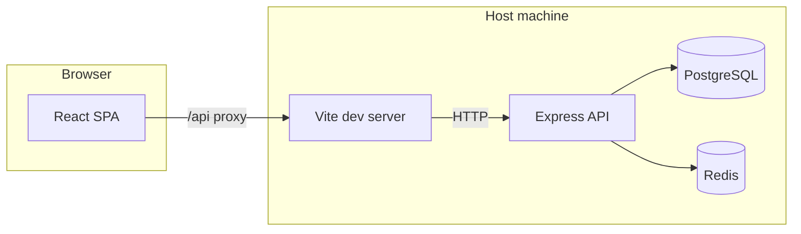

# Expense Tracker — Architecture and design

This document describes how the application is structured, how major components interact, and the main design choices.

**Renewals:** See [**RENEWALS.md**](./RENEWALS.md) for the **Renewal** expense category, **`renewal_kind`**, **`/renewals`** page, combined **Projection** (**Active** rows only; **`cancelled`** excluded), and import staging behavior.

**Prescriptions:** See [**PRESCRIPTIONS.md**](./PRESCRIPTIONS.md) for **`/prescriptions`**, the **`prescriptions`** table (**`renewal_period`** — **1–11 months** in monthly steps, then **1–5 years** — and **`next_renewal_date`**), **`prescriptionEnums.js`**, and **30-day in-app reminders** (**`PrescriptionReminders`**).

**Payment plans:** See [**PAYMENT_PLANS.md**](./PAYMENT_PLANS.md) for **`/payment-plans`**, the **`payment_plans`** table (**`remaining_payments`**, **`status`** including **`paid_in_full`** via **`resolvePaymentPlanStatusForRemaining`** in **`paymentPlanEnums.js`**), **`payment_plan`** expense-category sync (**`paymentPlanSync.js`**), the **Add payment plan** collapsible section (**Show** / **Hide**; default **closed**; auto-collapse on first non-empty list load or save), and the **Show cancelled (paid in full)** table filter (combined **Projection** follows visible rows).

**Budgeting:** See [**BUDGETING.md**](./BUDGETING.md) for **`budget_periods`** / **`budget_lines`**, **`GET`/`PUT`/`DELETE /api/budgets/:year/:month`**, threshold **`user_notifications`**, and the **Budget** hub (**`/budget`**, **`BudgetHubPage`**) plus **`ReportsPage`** variants (**`monthly_budget`** vs **`full`**) for monthly variance/charts/exports.

**Income versus spend:** See [**INCOME_VS_SPEND.md**](./INCOME_VS_SPEND.md) for **`income_entries`**, **`GET /api/reports/cashflow/monthly`** (calendar-month actuals), **`GET /api/reports/run-rate-vs-income`** (recurring run rate vs obligations), and the projection modal. The legacy filename [**INCOME_AND_MINIMUM_CHECK.md**](./INCOME_AND_MINIMUM_CHECK.md) redirects there.

**Diagrams:** See [**ARCHITECTURE_DIAGRAM.md**](./ARCHITECTURE_DIAGRAM.md) for figures that illustrate: the system context (section 1), the topology from local development through a production deployment (section 1b), running processes with manual `npm` commands or PM2 during development, the Express route map (**`/health`** with **version**, **`/api/income`**, **`/api/budgets`**, **`/api/notifications`**, **`/api/reports`**, **`/api/backup`**, …), server modules (including **`routes/income.js`**, **`routes/budgets.js`**, **`routes/notifications.js`**, **`expenseEnums.js`**, **`paymentPlanEnums.js`**, **`recoveryCodeStorage.js`**), how client pages map to API routes (**`IncomePage`** and **`ExpensesPage`** embedded in **`BudgetHubPage`**, **`SavingsGoalsPage`**, **`RenewalsPage`**, **`PrescriptionsPage`**, **`PaymentPlansPage`**, **`YourExpensesPage`**, **`ReportsPage`**, **Profile** backup **v4** + **`incomeEntries`**, import flow), **Layout** shell navigation (**Income** label → **`/budget`**; **Lists** ▾ or **Savings** / **Expenses** / **Renewals** / **Prescriptions** / **Payment Plan** at **`lg`**+; **notification bell**; avatar menu **Profile**, **Upcoming expenses**, **Sign out** — no theme row), **renewal reminder tiers**, **import pipeline**, **backup export/restore** (see also [**`docs/diagrams/backup-export-restore.mmd`**](./diagrams/backup-export-restore.mmd)), the entity-relationship model, authenticated request sequences, and **OAuth**. OpenAPI (**`/api/openapi.json`**, **`/api/docs`**) is summarized in [DEPLOYMENT.md](./DEPLOYMENT.md); Swagger **Authorize** token flows are in [**API_AUTHORIZATION.md**](./API_AUTHORIZATION.md). Narrative docs for **Docker Compose**, **password recovery**, and **backup/restore** are in [USER_GUIDE.md](./USER_GUIDE.md) and [deployment/docker-compose/README.md](../deployment/docker-compose/README.md).

## High-level overview

The diagram in this section describes **local development**. When you are ready to ship: you run the Vite **production build**, serve the generated **`dist/`** directory as static files, and run the API behind **Transport Layer Security** and a **reverse proxy** (or on a separate host). See [**From development to production**](#from-development-to-production) and [Architecture diagrams, section 1b](./ARCHITECTURE_DIAGRAM.md#1b-from-development-to-production-topology).

During local development, the system follows a **three-tier** pattern:

```mermaid
flowchart LR
  subgraph browser [Browser]
    UI[React SPA]
  end
  subgraph host [Host machine]
    Vite[Vite dev server]
    API[Express API]
    PG[(PostgreSQL)]
    RD[(Redis)]
  end
  UI -->|"/api" proxy| Vite
  Vite -->|HTTP| API
  API --> PG
  API --> RD
```

- **Client:** The Vite development server serves a **React** single-page application, styled with Tailwind, with routes handled by React Router and HTTP calls made with Axios.  
- **Server:** A **Node.js** **Express** Representational State Transfer API, **JSON Web Token** bearer authentication, the **node-postgres** library (`pg`) for SQL, and **ioredis** for optional caching.  
- **Infrastructure (local):** Docker Compose can provide **PostgreSQL** and **Redis**. The API and single-page application are started with **npm** scripts; the default `docker-compose.yml` does not containerize those Node processes.

---

## From development to production

The lifecycle is **development first**, **production second**: you run and test on your machine, **then** build and deploy the same codebase to a hosted environment.

### Development (local)

- **Frontend:** The **Vite development server** runs the `vite` command and listens on a port such as **5173**. It serves source files with **Hot Module Replacement** (updates in the editor refresh parts of the page without a full reload) and **proxies** requests whose path begins with **`/api`** to the Express API.  
- **API:** **Express** listens on the port given by the `PORT` environment variable (for example **4000**). It is reachable through the Vite proxy or by calling the API host and port directly.  
- **Single-page application to API:** The browser treats the Vite origin (for example `http://localhost:5173`) as the **same origin** for JavaScript. Requests to **`/api`** are forwarded by Vite to the URL in **`API_PROXY_TARGET`** inside `client/.env`.  
- **PostgreSQL:** Runs locally or via Docker Compose. **Redis** is optional and used to cache report responses.  
- **Configuration:** Environment variables live in `server/.env` and `client/.env`.  
- **OAuth:** **`CLIENT_ORIGIN`** is typically `http://localhost:5173` during development. Identity-provider redirect URLs must match that origin.

### Production (deployed)

- **Build step:** Change into the `client` directory and run **`npm run build`**. That command runs the production build (Vite `build`) and writes static files—HTML, JavaScript, and CSS—into **`client/dist/`**. **Do not** run the Vite **development** server for end users. Serve only the contents of **`dist/`** from a static file server.  
- **Frontend hosting:** Use **nginx**, **Caddy**, a cloud object store with a content delivery network, a platform-as-a-service static host, or similar.  
- **API:** The same **Express** application, typically behind **Transport Layer Security**, a **process manager** (systemd, PM2, Docker), or **orchestration** software.  
- **Single-page application to API:** Often **one public origin** where the edge server routes `/` to static files and `/api` to Node.js, so the built client can keep `baseURL: "/api"`. Alternatively, **two origins** (separate URLs for the static site and the API) with **Cross-Origin Resource Sharing** configured on Express.  
- **Health checks:** **`GET /health`** on the API returns JSON `{ ok: true, version: "<release>" }` ( **`version`** from **`APP_VERSION`** or **`server/package.json`**). In **`deployment/docker`**, nginx proxies **`GET /health`** at the same public origin so monitors can hit the edge without a separate API port mapping.  
- **PostgreSQL and Redis:** Managed services or hardened self-hosted instances; backups; **secrets** supplied through environment variables or a secret manager (never commit production secrets to the repository).  
- **OAuth:** **`CLIENT_ORIGIN`** and identity-provider redirect URLs use your public **HTTPS** application URL (scheme, host, and port must match what users type).

**Summary:** During **development**, you run Vite, Express, PostgreSQL, and optionally Redis. **After that**, in **production**, you serve the static bundle produced by **`npm run build`**, run Express with PostgreSQL and optional Redis, terminate **HTTPS** at the edge, and route paths for `/` versus `/api` accordingly.

**Container deployment:** The repository includes **`deployment/docker-compose/`** for a full stack on one host (Postgres, Redis, API, nginx serving **`dist/`** with **`/api`** and **`/health`** proxies; persistent volumes). **`docker-compose-build.yml`** builds **api** and **web** locally (**`npm run compose:build`**). **`docker-compose-prod.yml`** pulls pre-tagged images (**`npm run compose:prod`**; optional **`compose:prod:pull`**). Both flows run **`ensure-env.mjs`** first and use **`--env-file deployment/docker-compose/.env`**. The **api** service uses **`env_file: .env`** beside the Compose file so **`JWT_SECRET`** and **`CLIENT_ORIGIN`** reach the container reliably. See [deployment/docker-compose/README.md](../deployment/docker-compose/README.md). **`deployment/kubernetes/`** targets a cluster; see [deployment/README.md](../deployment/README.md).

---

## Repository layout

| Path | Role |
|------|------|
| `client/` | Frontend single-page application (Vite, React, Tailwind). |
| `server/` | Backend API (Express, ECMAScript modules via `"type": "module"` in `package.json`). |
| `docker-compose.yml` | PostgreSQL and Redis for local development. |
| `docs/` | User-facing and architecture documentation. |
| `deployment/` | Dockerfiles, production Docker Compose stack, and Kubernetes manifests. |
| Root `package.json` | Optional scripts: **`compose:build`** / **`compose:build:*`** (**`docker-compose-build.yml`**), **`compose:prod`** / **`compose:prod:*`** (**`docker-compose-prod.yml`**), **`compose:ensure-env`**. |

---

## Client architecture

### Stack

- **React 18** with function components.  
- **React Router version 6** — Public routes include `/login`, `/register`, **`/recover`**, and **`/oauth/callback`**. The `/` route is handled by an auth-aware shell: signed-out visitors see **`LandingPage`**; signed-in users enter **`Layout`**. Non-public routes redirect to `/login` when signed out. Authenticated routes include `/`, **`/expenses/list`**, **`/savings`**, **`/renewals`**, **`/prescriptions`**, **`/payment-plans`**, **`/budget`** (hub with **`?view=`** for **income** / **import** / **reports**), **`/reports`**, **`/profile`**. **`/expenses`** and **`/income`** are **`Navigate`** aliases to **`/budget?view=import`** and **`/budget?view=income`**. The **`Layout`** header shows **Income** (**NavLink** to **`/budget`**) and, below **`lg`**, a **Lists** dropdown for **Savings**, **Expenses**, **Renewals**, **Prescriptions**, **Payment Plan**; at **`lg`**+ those five are inline **NavLink**s. **Import** and paycheck **Income** are **tabs** inside **`BudgetHubPage`**, not separate header links. No top-level **Reports** link; **`ReportsPage`** is **`/reports`** or embedded in the hub. **Profile**, **Upcoming expenses**, **Sign out** in the avatar menu; **theme** under **Profile** → **Appearance**. **Post-login:** `GET /api/expenses?limit=1` — if any expense exists → **`/expenses/list`**; else → **`/budget?view=import`**. Same for `/`, login, register, OAuth, and `/login` while signed in.  
- **Tailwind CSS** — Utility-first styling with a dark theme.  
- **Axios** — A single HTTP client instance with `baseURL: "/api"`. **`FormData`** uploads omit the `Content-Type` header so the browser sets the multipart boundary automatically.  
- **Recharts** — Bar charts on the Reports page.  

### Authentication flow

- Tokens and user profile fragments are stored in the browser’s **`localStorage`** (keys defined in `authStorage.js`).  
- An Axios **request interceptor** in `api.js` adds `Authorization: Bearer <token>` to **every** request, reading the current token from `localStorage`. That avoids a race where child components issued API calls before a `useEffect` could set default headers (a historical “Missing token” issue).  
- A **response interceptor** in `api.js` treats fatal auth **401** responses (`missing token`, `invalid token`, `session expired`, inactivity timeout) as terminal, clears browser auth storage, and redirects to **`/login?expired=1`**. Login, register, recover-password, and refresh requests are excluded from this hook to avoid loops.  
- **`AuthProvider`** in `auth.jsx` still exposes session state (`setSession`, `logout`) to the component tree; `SessionExpiredModal` remains available for refresh-style flows where used.  
- **Route gating:** `AppShell` serves **`LandingPage`** for signed-out visits to `/`. For signed-out visits to authenticated app paths, it redirects to `/login`; signed-in users render `Layout` with nested routes.  
- **Single sign-on:** **`SsoButtons`** send the browser to `GET /api/auth/oauth/:provider` (proxied to Express). The API redirects to the identity provider, then handles `GET /api/auth/oauth/:provider/callback`, exchanges the authorization code, issues a JSON Web Token, and redirects the browser to **`/oauth/callback?token=…`** or **`/oauth/callback?error=…`**. **`OAuthCallbackPage`** stores the token and uses the same post-login navigation as email-and-password flows.

### Development-only proxy

- **`vite.config.js`** uses `loadEnv` so **`API_PROXY_TARGET`** from `client/.env` can point the `/api` proxy at the correct host and port (for example when the API does not use port 4000).  
- This proxy runs **only during development**. After **`npm run build`**, static hosting does not run Vite. See [From development to production](#from-development-to-production).

### Domain helpers

- **`expenseOptions.js`** — Canonical option lists and display formatters for **category** (including **`streaming_service`**, **Renewal**, and **Payment Plan**), **`RENEWAL_KIND_OPTIONS`** / **`formatRenewalKind`**, **frequency**, **financial institution**, and **expense state** (**Active** / **Paused** / **Cancelled**; API values `active` / `paused` / `cancelled`). **Frequency** allow-list: `once`, `weekly`, `monthly`, `bimonthly`, `yearly`. The server derives **`payment_day`** and **`payment_month`** from **`spent_at`** on create and update.  
- **`projection.js`** — Derives annual recurring totals from each row’s **amount** and **frequency** for **Projection** modals and pie charts: weekly × 52, monthly × 12, bi-monthly × 6, yearly × 1; **once** contributes to one-time totals only. **`payment_day`** and **`payment_month`** are not used in projection math. Callers pass the item list; **`RenewalsPage`** filters out non-**active** **`state`** (for example **`cancelled`**) before calling **`computeSpendingProjection`** / **`computeProjectionPieData`** for the combined Renewals modal.  
- **`renewalSchedule.js`** — Computes the next local-calendar renewal date from **frequency** and **`spent_at`** (day-of-month capped at 30; yearly uses the transaction’s calendar month). **`renewalReminderTier(daysUntil)`** assigns **three contiguous bands** (whole calendar days until renewal): **0–14**, **15–24**, and **25–40**; outside that range no banner line is shown. For about **two weeks** after a renewal date, the **25–40** day band is suppressed so a row does not reappear immediately for the following cycle’s early window. **`RenewalReminders.jsx`** uses **`nextRenewalDate`**, **`daysUntilRenewal`**, **`isEarlyRenewalTierSuppressedAfterRecentOccurrence`**, and **`renewalReminderTier`** with a user-configurable day-window cap (**default 7**, discrete options **1**/**3**/**5**/**7**/**10**/**14**/**21**/**30**/**40** from **`renewalPreferences.js`**) so only rows within the selected horizon appear. **Cancelled** rows that pass renewal are auto-excluded from the panel after the hide rule and mirrored in **`renewalHiddenPreferences.js`** for **Profile** (see **`ProfilePage`**).  
- **`prescriptionOptions.js`** / **`prescriptionSchedule.js`** — Prescription **category** and **`renewal_period`** labels (**`one_month`** … **`eleven_months`**, **`one_year`** … **`five_years`**); **`daysUntilPrescriptionRenewal`**, **`prescriptionNeedsReminder`** (≈30-day window plus short overdue band), and **`advanceNextRenewalDate`** (calendar **months** or **years**) after **Renewed**. See [**PRESCRIPTIONS.md**](./PRESCRIPTIONS.md).

### Pages

- **`LandingPage`** at `/` (signed-out only) — Public marketing-style entry screen with links to `/login` and `/register`; rendered by `AppShell` when there is no active session.  
- **`LoginPage` and `RegisterPage`** — Email and password forms; password sign-in now uses a challenge flow (`POST /auth/login` then `POST /auth/verify-2fa` or `POST /auth/setup-2fa/verify`); **`SsoButtons`** for Google (Gmail), GitHub, GitLab, and Microsoft 365 when OAuth is configured; link to **`/recover`**; error display uses **`apiError.js`** where applicable.  
- **`RecoverPasswordPage`** at `/recover` — **`POST /api/auth/recover-password`** with a **recovery code** (created in Profile) and a new password; does not send email.  
- **`OAuthCallbackPage`** at `/oauth/callback` — Reads **`token`** or **`error`** from the query string after the API redirects from **`GET /api/auth/oauth/:provider/callback`**, stores the JSON Web Token, and applies the same post-login navigation as password-based flows.  
- **`AdminPage`** at `/admin` — Operator console with tabs for **Session**, **System health**, **Backup & restore**, **User accounts**, and **Swagger**. Uses a separate admin auth flow (`/api/admin/auth/*`) with TOTP 2FA; embeds docs from **`/api/docs`** (Swagger UI) and links to **`/api/openapi.json`**, which documents user backup **version** **4** (**`UserBackupExport`**, **`BackupRestoreRequest`** schemas), **GET /health** behavior in **`info.description`**, and admin backup **version** **2**.
- **`ProfilePage`** at `/profile` — Change **email** and **password**; single-sign-on-only users can **set an initial password** here; **generate or remove a recovery code** (`POST` / `DELETE /api/auth/recovery-code`); when a code exists, the UI shows a **masked placeholder** (the plaintext is shown **only once**, at creation or replace); **profile picture** (`POST` / `DELETE /api/auth/avatar`); **Appearance** preferences include **Theme** (**Midnight** / **Ember** / **Daylight**), **Table display** for list pagination (**Rows per page**: **5**, **10**, **25**, **50**, **100**, default **5** via **`tablePreferences.js`** / **`localStorage`**), **Upcoming renewals window (days)** (**1**, **3**, **5**, **7**, **10**, **14**, **21**, **30**, **40**; default **7**), and **Auto-hidden cancelled recurring items** (read-only list from **`renewalHiddenPreferences.js`** for expenses the **Upcoming expenses** panel removed under the cancelled + past-renewal rule); **`GET /api/backup/export`** and **`POST /api/backup/restore`** for JSON backup (**append** or **replace**): current exports use **`version`** **`4`** (**expenses**, **prescriptions**, **paymentPlans**, **incomeEntries**, **`account`**); older **`version`** **`1`**–**`3`** files still restore; **replace** clears tables according to file **`version`** (income only when **`version`** ≥ **`4`**); optional **`account.recoveryCode`** in the download; **409** **`BACKUP_ACCOUNT_MISMATCH`** unless **`confirmCrossAccountRestore`** when emails differ; **`PATCH /api/auth/profile`** may return a new token when the email changes.  
- **`ExpensesPage`** — **Import** UI (manual add, **`ImportRulesPanel`**, statement upload, staging table, **AI suggest**). Rendered inside **`BudgetHubPage`** on the **Import** tab (**`/budget?view=import`**) with **`embedded`** (no duplicate page **H1**). Route **`/expenses`** redirects to **`/budget?view=import`**. Onboarding when there are no saved expenses; **Import from statement** and **Add expense manually** use **Show** / **Hide** (default **collapsed**); with staged import rows, those sections stay expanded. Long import instructions use a circular **i** (**`
`**). **`YourExpensesPage`** at `/expenses/list` — Fetches **`GET /api/expenses`** but the **table and combined Projection** omit **`renewal`** and **`payment_plan`** categories. Empty state links to **`/budget?view=import`**. **`ExpenseTable`** is read-only; **Edit** opens **`ExpenseEditModal`**. Statement staging includes **Renewal** columns when applicable.  
- **`RenewalsPage`** at **`/renewals`** — Lists **`GET /api/expenses?category=renewal`** (up to 500 rows); defaults manual add to category **Renewal** and frequency **yearly**; **`ExpenseTable`** always shows renewal columns (read-only list) and passes **`onRowProjection`**; **Edit** uses the same **`ExpenseEditModal`** as **`YourExpensesPage`**. Combined header **Projection** and per-row **Projection** use **`projection.js`**; combined totals use **Active** rows only—**`cancelled`** and **`paused`** excluded. The table header flashes a brief **update indicator** after successful save/add updates. Client-side pagination and **Rows** selector; sticky **Actions** column. See [**RENEWALS.md**](./RENEWALS.md).  
- **`PaymentPlansPage`** at **`/payment-plans`** — CRUD for **`payment_plans`** (**`GET`/`POST`/`PATCH`/`DELETE /api/payment-plans`**). Tracks category, payment schedule, priority, status, account type, payment method, institution, tag, frequency, optional **`remaining_payments`** (# of payments left before paid off), amount, and notes. When **`remaining_payments`** is **0**, the server sets **`status`** to **`paid_in_full`**; the client labels that **Cancelled (paid in full)** and **hides** those rows unless **Show cancelled (paid in full)** is checked; combined **Projection** uses the same visible set. If account type is **Credit Card**, institution options are **VISA**, **American Express**, and **Mastercard**. The **Add payment plan** card is collapsible (**Show** / **Hide**); default **`addOpen`** is **false**. A **`useEffect`** sets **`addOpen`** to **false** the first time **`items.length`** becomes **> 0** after load or save (**`hadItemsRef`**). Header includes **Search notes** and **update flash**. **Edit** opens a **modal** with **`PaymentPlanFormFields`**. Expense **`payment_plan`** rows sync via **`source_expense_id`**. See [**PAYMENT_PLANS.md**](./PAYMENT_PLANS.md).
- **`PrescriptionsPage`** at **`/prescriptions`** — CRUD for **`prescriptions`** (**`GET`/`POST`/`PATCH`/`DELETE /api/prescriptions`**). Tracks **name**, **amount**, **category** (medical … equipment), **`renewal_period`** (monthly **1–11** or **1–5 years**), **`next_renewal_date`**, **vendor**, **notes**, **state** (**`active`** / **`paused`** / **`cancelled`**). The list table is read-only; **Edit** opens a **modal** with shared **`PrescriptionFormFields`** (same as **Add prescription**). **Add prescription** uses **Show** / **Hide** (default **collapsed**). Header and per-row **Projection**; combined totals exclude non-**active** **`state`**. **Renewed** advances **`next_renewal_date`** by one **`renewal_period`** on the client (**`setMonth`** / **`setFullYear`**), then **PATCH**. Brief **update indicator** after successful add/edit/renew saves. Client-side pagination and **Rows** selector. See [**PRESCRIPTIONS.md**](./PRESCRIPTIONS.md).  
- **`IncomePage`** — CRUD for **`income_entries`** via **`/api/income`**; **`GET /api/reports/run-rate-vs-income`** for the run-rate banner. Embedded in **`BudgetHubPage`** on the **Income** tab (**`embedded`** hides duplicate **H1**); **`/income`** redirects to **`/budget?view=income`**. **Add entry** block: **Show** / **Hide** (default **collapsed**). See [**INCOME_VS_SPEND.md**](./INCOME_VS_SPEND.md).  
- **`SavingsGoalsPage`** at **`/savings`** — CRUD for savings goals via **`/api/savings-goals`**.  
- **`BudgetHubPage`** at **`/budget`** — **Budget & reports** hub: tab order **Income**, **Import**, **Budget** (default when **`?view`** absent), **Reports**. Renders **`IncomePage`** (**`?view=income`**), **`ExpensesPage`** (**`?view=import`**), or **`ReportsPage`** (**`monthly_budget`** / **`full`**) with **`embedded`**, keyed by tab.  
- **`ReportsPage`** — Fetches report and budget endpoints; **period tabs** when **`variant="full"`** or standalone **`/reports`**; **`variant="monthly_budget"`** locks monthly layout. **`embedded`** suppresses standalone **H1** / home link. **Monthly budget** card: **Show** / **Hide** (default **collapsed**).  
- **`Layout`** — Primary nav: **Income** (**`/budget`**) always visible; **Lists** ▾ below **`lg`** or inline **Savings** → **Expenses** → **Renewals** → **Prescriptions** → **Payment Plan** at **`lg`**+. Avatar **account menu**: **Profile**, **Upcoming expenses**, **Sign out**. **`renewalTablesExpanded`** and **amber badge** behavior unchanged. **`RenewalReminders`** / **`PrescriptionReminders`** above **`Outlet`** on shell routes (including **`/budget`** and **`?view=`**).  
- **Session expiry handling** — Fatal auth responses clear local auth and send the user to **`/login?expired=1`**; `SessionExpiredModal` is retained for explicit refresh continuation patterns.

---

## Server architecture

### Entry and lifecycle

- **`index.js`** loads environment variables (`dotenv`), runs **`ensureJwtSecret()`** (in **non-production**, generate and persist weak/missing `JWT_SECRET` to **`server/.env`**; in **`NODE_ENV=production`**, exit if unset/weak so Docker relies on host **`.env`**—see **`deployment/docker-compose/ensure-env.mjs`**), runs **`initDb()`** (data definition language and additive migrations), starts the **monthly summary** scheduled job, then calls **`listen`** on `PORT`.  
- **Cross-Origin Resource Sharing** allows `CLIENT_ORIGIN` or reflects an open configuration in development.

### Routing

| Mount | Responsibility |
|--------|----------------|
| `GET /health` | Liveness check; no authentication. Response includes **`version`** (release string). |
| `/api/docs` and `/api/openapi.json` | **API documentation.** `/api/openapi.json` serves an OpenAPI 3 spec for the API. `/api/docs` serves **Swagger UI** for interactive exploration and “Try it out” requests. Security schemes (**`bearerAuth`**, **`adminBearerAuth`**, **`adminReauth`**) and how to fill **Authorize** are described in [**API_AUTHORIZATION.md**](./API_AUTHORIZATION.md). |
| `/api/auth` | `POST /register` creates password users; `POST /login` now returns a 2FA challenge; **`POST /verify-2fa`** verifies existing user TOTP; **`POST /setup-2fa/verify`** enrolls TOTP on first password login; **`GET /me`** requires a token and returns **`id`**, **`email`**, **`avatar_url`**, **`has_password`**, **`has_recovery_code`**; **`POST /refresh`** re-issues a JWT from an expired token if signature and server-side session are still valid (grace period after **`exp`**); **`PATCH /profile`** updates email and/or password (SSO-only users can set a first password without a current password); **`POST /recovery-code`** and **`DELETE /recovery-code`** (authenticated) create or clear an offline **recovery code** (see **Recovery code storage** below); **`POST /recover-password`** (unauthenticated, rate-limited) resets password from that code—**no email**; **`POST /avatar`** (multipart image) and **`DELETE /avatar`** manage profile pictures (files under **`server/uploads`**, served at **`/api/uploads`**); **`GET /oauth/:provider`** and **`GET /oauth/:provider/callback`** implement the OAuth2 authorization code flow for `google`, `github`, `gitlab`, and `microsoft`, find or create users and **`oauth_identities`** rows, then redirect the browser to `CLIENT_ORIGIN/oauth/callback` with a token. |
| `/api/expenses` | Create, read, update, delete for expenses; list supports optional **`category`** query (exact allow-list match, for example **`renewal`** for the Renewals page). Optional body fields **`website`** and **`renewal_kind`**; when **`category`** is **`renewal`**, **`renewal_kind`** is **required** on create and when changing category to **`renewal`**. **`category = payment_plan`** synchronizes a linked row in **`payment_plans`** via **`source_expense_id`**. Optional **`state`**: **`active`** (default), **`paused`**, or **`cancelled`**; **`payment_day`** (1–30) and **`payment_month`** (1–12) are **set from `spent_at`** on create and update (ignored if sent in the body); **JSON Web Token required**. |
| `/api/payment-plans` | Create, read, update, delete payment plans: category, payment schedule, priority, **status** (allow-list includes **`paid_in_full`**), account type, payment method, institution, tag, frequency, optional **`remaining_payments`**, notes, amount. **POST** and **PATCH** apply **`resolvePaymentPlanStatusForRemaining`**: **`remaining_payments === 0`** → **`status`** **`paid_in_full`**; **`paid_in_full`** with **`remaining_payments` ≠ `0`** (including **`null`**) → **`active`**. **JSON Web Token required**. |
| `/api/imports` | Statement upload into **`import_batches`** and **`import_staging_rows`**; per-row **category**, **frequency**, and (when category is **`renewal`**) **`renewal_kind`** and optional **`website`**; staging **`PATCH`** can update those fields; changing **category** away from **`renewal`** clears **`renewal_kind`**. Staging and commit derive **`payment_day`** / **`payment_month`** from each line’s **`spent_at`**; **commit** inserts into **`expenses`** only where **category** is set and, for **`renewal`**, **`renewal_kind`** is set (**`state`** **`active`** on each new row; **`website`** / **`renewal_kind`** copied only for **`renewal`** rows); **JSON Web Token required**. |
| `/api/reports` | Aggregated spending, **`GET /cashflow/monthly`** (actuals in a calendar month), **`GET /run-rate-vs-income`** (recurring run-rate income vs combined obligations), CSV/PDF exports, persisted monthly summaries; **JSON Web Token required**. See [**INCOME_VS_SPEND.md**](./INCOME_VS_SPEND.md). |
| `/api/income` | Create, read, update, delete **`income_entries`** (amount, frequency, description, **`received_at`**, **`payment_day`** / **`payment_day_2`** when **`bimonthly`**); **JSON Web Token required**. See [**INCOME_VS_SPEND.md**](./INCOME_VS_SPEND.md). |
| `/api/savings-goals` | Create, read, update, delete per-user savings goals (name, target amount, current balance, optional target date). **JSON Web Token required**. |
| `/api/budgets` | **`GET`/`PUT`/`DELETE /api/budgets/:year/:month`** — monthly **`budget_periods`** and **`budget_lines`** with variance vs actuals; **`PUT`** syncs **`user_notifications`** with **`kind`** **`budget_total_threshold`** / **`budget_category_threshold`**. **JSON Web Token required**. See [**BUDGETING.md**](./BUDGETING.md). |
| `/api/notifications` | **`GET /`** (syncs current-month budget threshold alerts, then lists recent rows), **`PATCH /:id/read`**, **`POST /read-all`**. **JSON Web Token required**. See [**BUDGETING.md**](./BUDGETING.md). |
| `/api/prescriptions` | Create, read, update, delete **prescription** rows (separate from **`expenses`**). Fields: **`name`**, **`amount`**, **`renewal_period`** (**`PRESCRIPTION_RENEWAL_PERIODS`**: **`one_month`** … **`eleven_months`**, **`one_year`** … **`five_years`**), **`next_renewal_date`**, **`vendor`**, **`notes`**, **`category`**, **`state`** (**`active`** / **`paused`** / **`cancelled`**). Allow-lists in **`prescriptionEnums.js`**. **JSON Web Token required**. |
| `/api/backup` | **`GET /export`** — JSON for the signed-in user: `format` **`expense-tracker-backup`**, **`version`** (**`4`** current; **`1`**–**`4`** on restore), **`exportedAt`**, legacy top-level **`email`**, **`account`** (**`userId`**, **`email`**, **`label`**, **`hasRecoveryCode`**, optional plaintext **`recoveryCode`** when ciphertext exists), **`expenseCount`**, **`renewalCount`**, **`expenses`** (each expense includes **`state`**: **`active`**, **`paused`**, or **`cancelled`**—see **`normalizeExpenseStateForBackup`**), **`prescriptionCount`**, **`prescriptions`** (v2+), **`paymentPlanCount`**, **`paymentPlans`** (v3+), **`incomeEntryCount`**, **`incomeEntries`** (v4+). **`POST /restore`** — same **`version`** range; **`mode`** **`append`** or **`replace`**. **Replace** v**`1`**: **`expenses`** only. v**`2`**: + **`prescriptions`**. v**`3`**: + **`payment_plans`**. v**`4`**: + **`income_entries`**. **Append** merges rows from the file when each version’s arrays are present. Cross-account **409** **`BACKUP_ACCOUNT_MISMATCH`** without **`confirmCrossAccountRestore`**. Validates like **`POST /expenses`**, **`POST /prescriptions`**, **`POST /payment-plans`**, **`POST /income`** as applicable. At most **25,000** rows per array; body limit **15 MB**. **JWT required**. |
| `/api/admin` | **Admin API** backing the `/admin` UI (operational site). Authentication is separate from user JWTs: **admin password + TOTP 2FA** are required. Admin sessions time out after **15 minutes of inactivity**, and sensitive operations require **re-authentication** (password + 2FA) even within an active session; Swagger uses **`adminBearerAuth`** plus header **`x-admin-reauth`** (**`adminReauth`**). Endpoints include: `GET /health` (API + **web UI probe** + DB connectivity + basic DB sanity + application resources), `GET /backup/user/:userId`, `GET /backup/database` (**reauth**), `POST /restore/preview`, `POST /restore/database` (**reauth**), `GET /users`, `POST /users/:userId/reset-password` (**reauth**), `PATCH /users/:userId/permissions` (**reauth**). See [**API_AUTHORIZATION.md**](./API_AUTHORIZATION.md). |

### Authentication

- The JSON Web Token payload uses **`sub`** as the user id and a session id (**`jti`**). **`middleware/auth.js`** validates the token and an active server-side session entry (inactivity timeout enforced) before setting **`req.userId`**.  
- Protected route handlers read **`req.userId`**.  
- Users who registered with a password have **`password_hash`** set. **Single-sign-on-only** users may have **`password_hash`** null until they set a password in **Profile**; until then, password login directs them to sign in with a provider or set a password after SSO (`routes/auth.js`).  
- **Password recovery without email:** Users who generated a code in Profile store **`recovery_lookup`** and a bcrypt hash of the secret token. **`recovery_code_ciphertext`** stores the same token **encrypted at rest** (**`server/src/recoveryCodeStorage.js`**: AES-256-GCM, key derived from **`JWT_SECRET`**, additional authenticated data ties the blob to **`users.id`**) so **`GET /backup/export`** can include plaintext **`account.recoveryCode`** while **`recovery_token_hash`** remains a one-way bcrypt check. **`DELETE /recovery-code`**, successful **`POST /recover-password`**, and replacing the code clear ciphertext with the hash fields. **`POST /backup/restore`** may reapply **`account.recoveryCode`** to the signed-in user. Legacy accounts that have a hash but no ciphertext export **`hasRecoveryCode`** without **`recoveryCode`** until the user replaces the code once.  
- **OAuth** code in `server/src/oauth/`: short-lived random **`state`** (CSRF protection), per-provider token exchange and profile retrieval, **link or create** user by email and identity (`oauth_identities`).  
- **`POST /refresh`** verifies the Bearer JWT with **`ignoreExpiration: true`** (signature, **`sub`**, and active server-side session must be valid), reloads the user from **`users`**, revokes the previous session id, and issues a new token. If the token had an **`exp`** claim, refresh is refused when too long after that expiry (grace window in **`routes/auth.js`**).  
- Authentication errors return HTTP **401** with JSON `{ error: ... }`. PostgreSQL connectivity issues may return **503** with a clearer message where detected (`routes/auth.js`).

### Expenses domain

- **Validation** uses **allow-lists** for category (including **`streaming_service`**, **`renewal`**, and **`payment_plan`**), **`renewal_kind`** when **`category`** is **`renewal`** (`expenseEnums.js` / **`RENEWAL_KINDS`**—extended as needed, for example **`online_education`** for online education renewals), `financial_institution`, `frequency` (`once`, `weekly`, `monthly`, `bimonthly`, `yearly`; matching client dropdowns), and **`state`** (`active`, `paused`, `cancelled`; default **`active`** on create if omitted). **`website`** is optional trimmed text (length-capped). **`payment_day`** (1–30) and **`payment_month`** (1–12) are set by the server from **`spent_at`** (request body values for those fields are ignored on create/update).  
- Dates are stored as **`DATE`** (`spent_at`); amounts as **`NUMERIC`**.  
- List endpoints support optional `from` and `to` query filters and pagination limits.  
- **Statement import:** **`multer`** and **`parseVisaStatement.js`** populate staging tables. The upload form sets **institution** and **frequency**. Each staging row’s **`payment_day`** and **`payment_month`** are derived from that line’s **`spent_at`**. The user assigns **category** (required to import) and may adjust **frequency** per row; **commit** writes only categorized rows to **`expenses`**, taking **`financial_institution`** from the batch and **`frequency`** from the row, setting **`state`** to **`active`**, and recomputing **`payment_day`** / **`payment_month`** from **`spent_at`**. **`pdf-parse`** is loaded via a subpath import to avoid an ECMAScript module debug harness issue.

### Reports

- Separate handlers for **daily**, **weekly**, **monthly**, **yearly**, and **custom range** queries; responses include **series** for charts and **totals**.  
- **Redis:** Report payloads may be cached with a short time-to-live (about two minutes) when `REDIS_URL` is set; failures fall back to uncached database queries.  

### Background job

- **`node-cron`** schedules a job (documented as **03:00 UTC on day 1** of each month) that aggregates **the previous calendar month** per user into **`monthly_summaries`**, using upserts.  
- This job is **separate** from interactive reporting (live reports always read **`expenses`**).

---

## Data model

### `users`

Columns include **`id`**, **`email`** (unique), **`password_hash`** (nullable for single-sign-on-only accounts), optional **`avatar_url`** (path to an uploaded profile image), optional **`totp_secret`** (user 2FA secret), optional **`recovery_lookup`** and **`recovery_token_hash`** (offline password recovery; cleared after a successful reset or when the code is removed), optional **`recovery_code_ciphertext`** (encrypted recovery plaintext for backup export; cleared with the other recovery fields), **`created_at`**.

### `oauth_identities`

**`user_id`** references **`users`**. **`provider`** is one of `google`, `github`, `gitlab`, `microsoft`. **`provider_user_id`** and **`email`** store identity data; uniqueness is enforced on **`(provider, provider_user_id)`**.

### `expenses`

**`user_id`** references **`users`**, plus **`amount`**, **`category`** (allow-list includes **`streaming_service`**, **`renewal`**, **`payment_plan`**, and others; see **`expenseEnums.js`**), **`financial_institution`**, **`frequency`**, **`state`** (`active`, `paused`, or `cancelled`, default **`active`**), **`payment_day`** (day of month 1–30, derived from **`spent_at`**), **`payment_month`** (calendar month 1–12, derived from **`spent_at`**), **`description`**, optional **`website`**, optional **`renewal_kind`** (required by API when **`category`** is **`renewal`**), **`spent_at`**, **`created_at`**.  
An index on **`(user_id, spent_at)`** supports typical lists and reports.  
Schema changes use **`CREATE TABLE IF NOT EXISTS`** and **`ALTER TABLE … ADD COLUMN IF NOT EXISTS`** so existing databases upgrade when the API starts.

### `monthly_summaries`

**`user_id`**, **`year`**, **`month`**, **`total`**, **`generated_at`**, with a unique constraint on **`(user_id, year, month)`** for idempotent updates from the cron job.

### `import_batches` and `import_staging_rows`

- **`import_batches`:** **`user_id`**, **`source_filename`**, **`default_financial_institution`**, **`default_frequency`**. A new upload **deletes** prior batches for that user (cascade deletes old staging rows).  
- **`import_staging_rows`:** **`batch_id`**, **`spent_at`**, **`amount`**, **`description`**, **`category`** nullable until required for commit, **`frequency`**, **`payment_day`** (1–30; derived from **`spent_at`**), **`payment_month`** (1–12; derived from **`spent_at`**), optional **`website`**, optional **`renewal_kind`**. **`PATCH /api/imports/rows/:id`** updates **`category`**, **`frequency`**, **`renewal_kind`**, and **`website`**; changing **`category`** away from **`renewal`** clears **`renewal_kind`**; **`payment_day`** / **`payment_month`** are recomputed from **`spent_at`** after each patch.

### `prescriptions`

**`user_id`** references **`users`**. **`name`**, **`amount`**, **`renewal_period`** (allow-list: **`one_month`** through **`eleven_months`**, **`one_year`** through **`five_years`**), **`next_renewal_date`**, **`vendor`**, **`notes`**, **`category`**, **`state`** (**`active`** / **`paused`** / **`cancelled`**), **`created_at`**. Included in **`GET /api/backup/export`** when **`version`** is **`2`** (**`prescriptions`** array). See [**PRESCRIPTIONS.md**](./PRESCRIPTIONS.md).

### `payment_plans`

**`user_id`** references **`users`**. **`source_expense_id`** optionally references **`expenses.id`** (used for automatic sync when an expense category is **`payment_plan`**), with a uniqueness constraint per user+source expense when present. Includes **`name`**, **`amount`**, **`category`**, **`payment_schedule`**, **`priority_level`**, **`status`** (allow-list includes **`paid_in_full`**, set by the API when **`remaining_payments`** is **0**), **`account_type`**, **`payment_method`**, **`institution`**, **`tag`**, **`frequency`**, optional **`remaining_payments`** (non-negative integer or **`null`**: payments remaining before paid off), **`notes`**, **`created_at`**. See **`resolvePaymentPlanStatusForRemaining`** in **`paymentPlanEnums.js`**.

---

## Cross-cutting design decisions

1. **Stateless JSON Web Token sessions** — No server-side session store; easier horizontal scaling, but no instant server-side revocation without extra machinery (for example a token blocklist). **`POST /refresh`** extends usability after expiry within a bounded grace window without storing refresh tokens.  
2. **Allow-lists on the API** — Prevents arbitrary strings for enum-like fields even if the user interface is bypassed.  
3. **Additive database migrations in `initDb`** — Simple for a small application; larger teams might adopt explicit migration tools.  
4. **Frequency as metadata** — Stored for the user’s records; **reporting** uses **`spent_at`**, not projected recurring charges into future periods.  
5. **`payment_day` / `payment_month` from `spent_at`** — Those columns are denormalized from the transaction date (day capped at 30) for renewals, imports, and backup JSON. Create, update, import commit, and restore **recompute** them; request bodies cannot override them independently of **`spent_at`**.  
6. **Redis optional** — Behavior is correct without Redis; with Redis, repeated report reads cost less.  
7. **OAuth optional** — Each provider is enabled only when its **`OAUTH_*`** client identifier and secret are set; unconfigured providers return HTTP **503** on `GET /oauth/:provider`. Identity linking uses **`oauth_identities`** and email matching for existing **`users`** rows.  
8. **`recovery_code_ciphertext` and `JWT_SECRET` rotation** — Ciphertext is keyed from the current secret; if **`JWT_SECRET`** changes, old blobs may fail to decrypt, so export can omit **`account.recoveryCode`** until the user **replaces** the recovery code (hash-based **`/recover-password`** still works if the code was unchanged).

---

## Related files

| Concern | Location |
|---------|-----------|
| Database bootstrap | `server/src/db.js` |
| JSON Web Token secret bootstrap | `server/src/ensureJwtSecret.js` (dev **`server/.env`**); Compose host bootstrap **`deployment/docker-compose/ensure-env.mjs`** |
| Authentication routes | `server/src/routes/auth.js` |
| User auth/session + user 2FA helpers | `server/src/userSecurity.js` |
| OAuth (single sign-on) | `server/src/oauth/oauthRoutes.js`, `oauthService.js`, `oauthState.js` |
| Expense routes | `server/src/routes/expenses.js` |
| Prescription routes | `server/src/routes/prescriptions.js` |
| Prescription enums; **`normalizePrescriptionStateForBackup`** (JSON export) | `server/src/prescriptionEnums.js` |
| Import staging and commit | `server/src/routes/imports.js` |
| Category (**including `renewal`** and **`payment_plan`**), **`renewal_kind`**, institution, frequency, **state** enums; **`spent_at`** → **`payment_day`** / **`payment_month`**; **`normalizeExpenseStateForBackup`** (JSON export) | `server/src/expenseEnums.js` |
| Payment plan enums, validation, and **`resolvePaymentPlanStatusForRemaining`** | `server/src/paymentPlanEnums.js` (**`routes/paymentPlans.js`**, **`routes/backup.js`** on restore) |
| Payment plan CRUD routes | `server/src/routes/paymentPlans.js` |
| Expense-to-payment-plan synchronization | `server/src/paymentPlanSync.js` |
| Statement parsing | `server/src/parsers/visaStatement.js` |
| Report routes and cache | `server/src/routes/reports.js`, `server/src/redis.js` |
| Backup and restore | `server/src/routes/backup.js` |
| Admin routes and security | `server/src/routes/admin.js`, `server/src/adminSecurity.js` |
| OpenAPI and Swagger mounting | `server/src/openapi.js`, `server/src/index.js` (`/api/docs`, `/api/openapi.json`); human guide [**API_AUTHORIZATION.md**](./API_AUTHORIZATION.md) |
| Recovery code encryption (backup round-trip) | `server/src/recoveryCodeStorage.js` |
| Monthly job | `server/src/jobs/monthlySummary.js` |
| Client HTTP client, token storage, session-expired redirect | `client/src/api.js`, `client/src/authStorage.js`, `client/src/components/SessionExpiredModal.jsx` |
| Renewal date math, grouped reminder UI, sortable renewal tables, badge toggle + account menu | `client/src/renewalSchedule.js`, `client/src/components/RenewalReminders.jsx`; mounted from **`Layout.jsx`** on all authenticated shell routes |
| Renewal reminder display preferences (window days) | `client/src/renewalPreferences.js` |
| Auto-hidden cancelled recurring items (Profile list; `localStorage` per user) | `client/src/renewalHiddenPreferences.js` (written from **`RenewalReminders.jsx`**) |
| Single sign-on user interface | `client/src/components/SsoButtons.jsx`, `client/src/pages/OAuthCallbackPage.jsx` |
| Admin UI | `client/src/pages/AdminPage.jsx` (`/admin`) |
| Profile and recovery | `client/src/pages/ProfilePage.jsx`, `client/src/pages/RecoverPasswordPage.jsx` |
| Renewals page (**`/renewals`**) | `client/src/pages/RenewalsPage.jsx` |
| Prescriptions page (**`/prescriptions`**) | `client/src/pages/PrescriptionsPage.jsx` |
| Prescription reminders banner | `client/src/components/PrescriptionReminders.jsx` |
| Expense enums and labels | `client/src/expenseOptions.js` |
| Manual expense add/edit field grid (**`ManualExpenseFormFields`**), **Edit** modal | `client/src/components/ManualExpenseForm.jsx`, `client/src/components/ExpenseEditModal.jsx` |
| Read-only expense/renewal table (**`ExpenseTable`**) | `client/src/components/ExpenseTable.jsx` |
| Payment plan options and labels (**`paid_in_full`** → **Cancelled (paid in full)**; add form omits **`paid_in_full`**) | `client/src/paymentPlanOptions.js` |
| Renewals feature (concepts, flows, API) | [RENEWALS.md](./RENEWALS.md) |
| Prescriptions feature (concepts, flows, API) | [PRESCRIPTIONS.md](./PRESCRIPTIONS.md) |
| Payment plans feature (concepts, flows, API, **`paid_in_full`**, add-section UX) | [PAYMENT_PLANS.md](./PAYMENT_PLANS.md) |

For day-to-day usage, see [USER_GUIDE.md](./USER_GUIDE.md).
