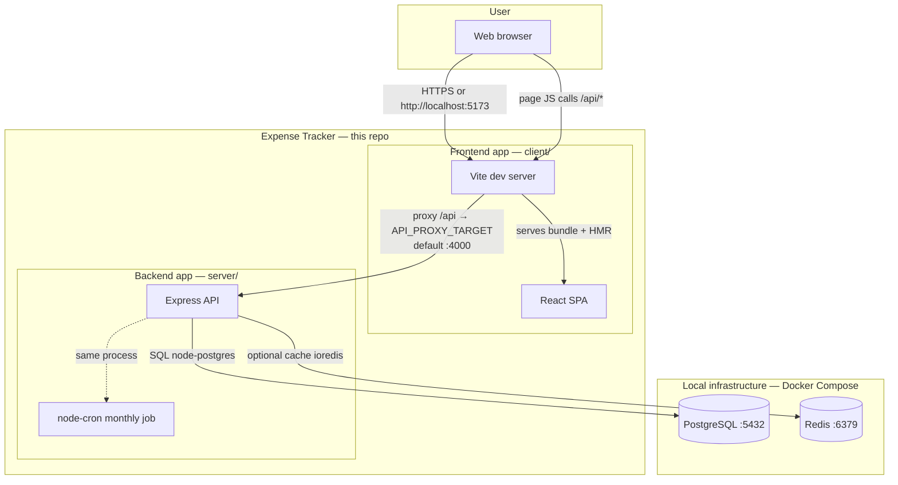
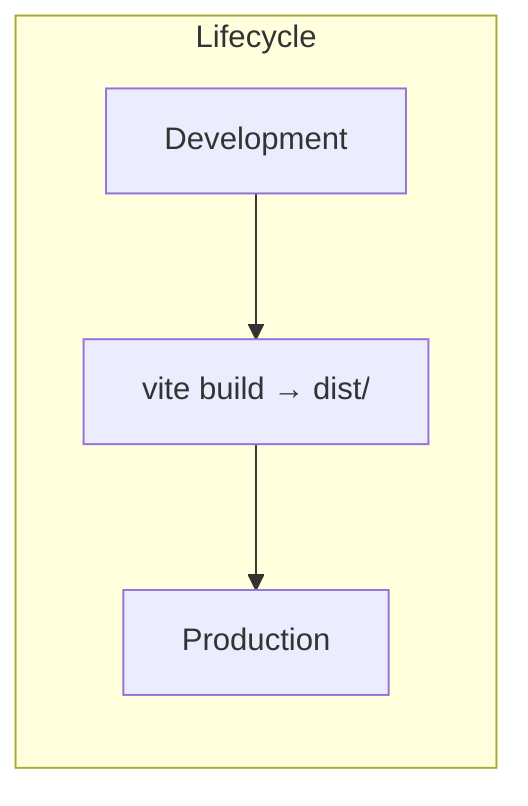
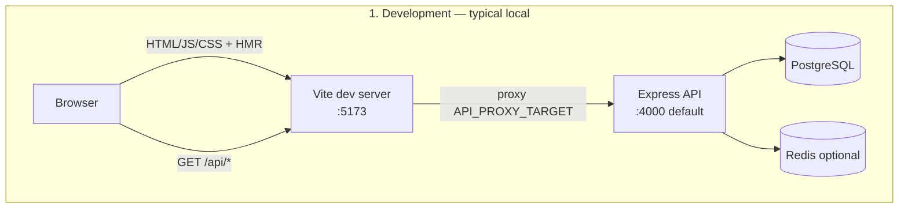
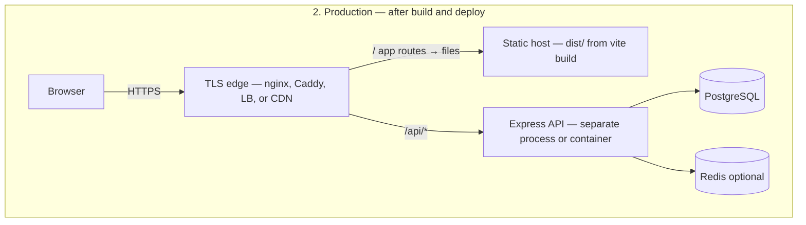
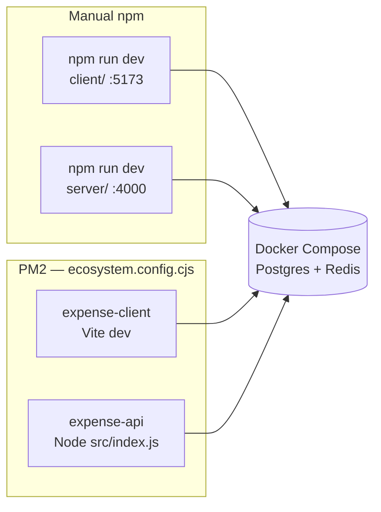
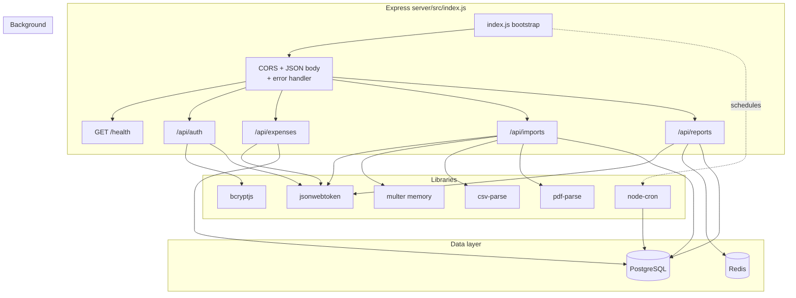
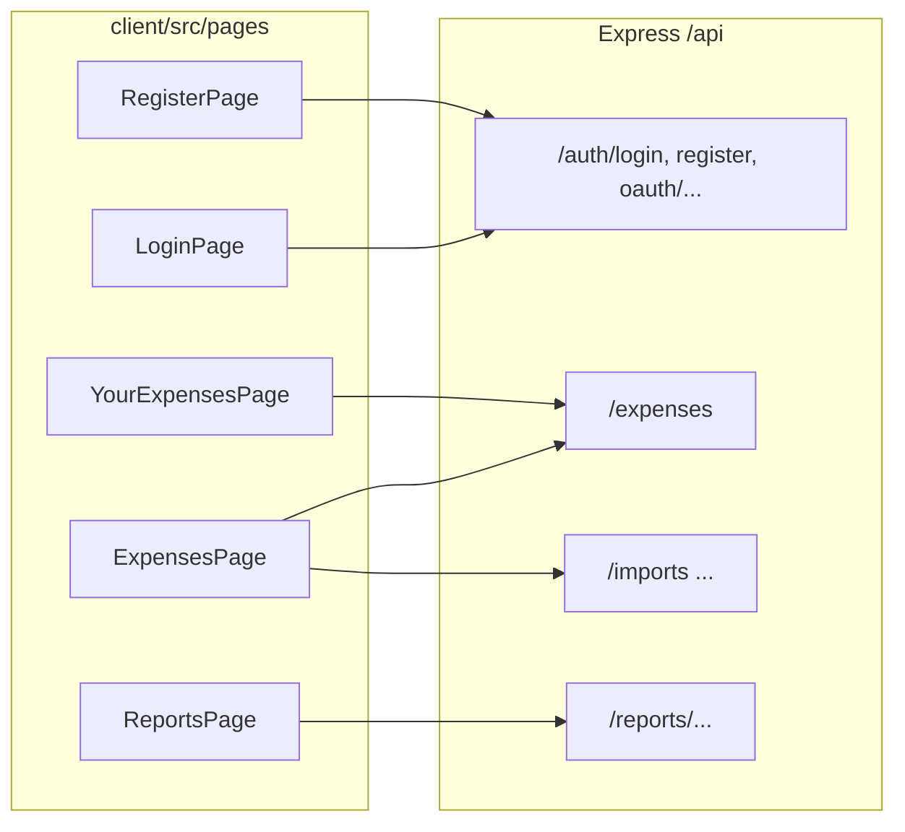
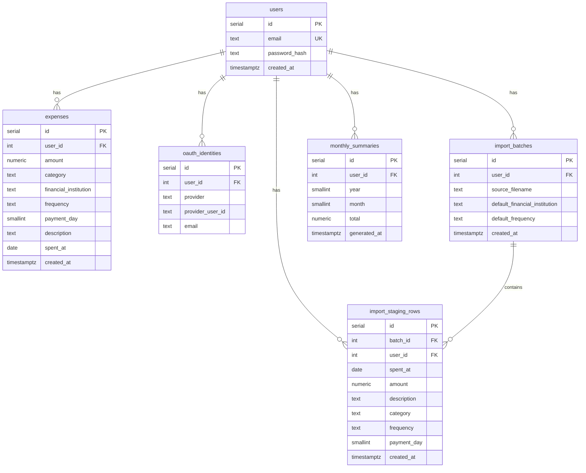
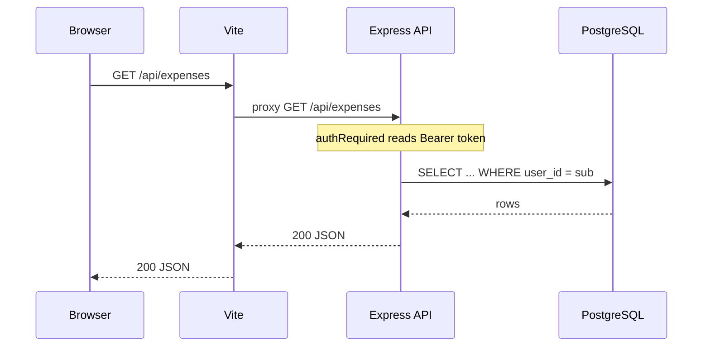
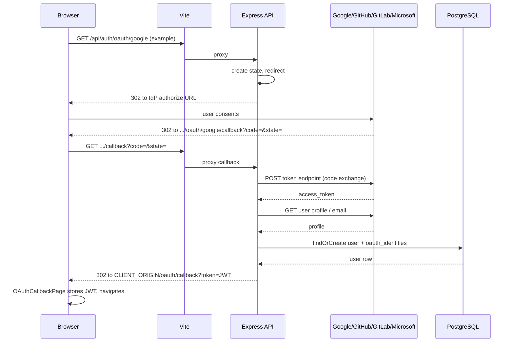

# Expense Tracker — Architecture diagrams

Visual overview of **applications**, **runtime processes**, and **integrations**. For narrative design notes, see [ARCHITECTURE.md](./ARCHITECTURE.md).

---

## 1. System context (containers)

Who talks to whom at deployment boundaries: browser, Node apps, and data services.

**Integrations (this diagram):**

| From | To | Protocol / mechanism |
|------|-----|----------------------|
| Browser | Vite | HTTP (HTML/JS/CSS), WebSocket (HMR) |
| Browser (via Vite) | Express | HTTP REST, path prefix `/api` proxied by Vite |
| Express | PostgreSQL | TCP, `DATABASE_URL`, SQL |
| Express | Redis | TCP, `REDIS_URL`, optional |
| Express | Google / GitHub / GitLab / Microsoft | OAuth 2.0 (browser redirect + HTTPS token endpoints); redirect URI on the SPA origin, proxied `/api` → API |

---

## 1b. From development to production (topology)

**§1** shows **development** (Vite + Express). **Then** you **`vite build`** and deploy: the **Vite dev server is not part of production**; the browser loads **static files** from **`dist/`**, and an **edge** (reverse proxy, CDN, or host) routes **`/api`** to **Express**.

| Stage | What runs |
|-------|-----------|
| **1. Development** | Vite dev server + **HMR**; same-origin **`/api`** proxied to Express; often HTTP on `localhost`. Commands: `npm run dev` in `client/` and `server/`. |
| **2. Production** | **`npm run build`** in `client/` → serve **`client/dist/`** (no Vite); Express behind TLS; **`/api`** via edge or CORS. `NODE_ENV=production` (or equivalent) for the API process. |

Narrative detail: [ARCHITECTURE.md — From development to production](./ARCHITECTURE.md#from-development-to-production).

---

## 2. Runtime: manual npm or PM2 (during development)

Two common ways to run the **same logical apps** (`expense-client`, `expense-api`) while developing; databases are unchanged.

- **Manual:** two shells; Vite proxy must match API `PORT` (`client/.env` → `API_PROXY_TARGET`).  
- **PM2:** both processes from repo root; logs under `logs/`. Other PM2 apps on the host (e.g. unrelated projects) share the same PM2 daemon but are separate apps.

---

## 3. Backend application — modules and integrations

Everything inside the **Express** process and how it connects to libraries and data.

| Module | Role | Integrations |
|--------|------|----------------|
| `routes/auth.js` | Register / login / `me` | `bcryptjs`, `jsonwebtoken`, `pg`; mounts **`oauth/*`** from `oauth/oauthRoutes.js` |
| `oauth/oauthRoutes.js` (+ `oauthService.js`, `oauthState.js`) | SSO: authorize + callback | `fetch` to IdPs, `pg` → `oauth_identities` |
| `routes/expenses.js` | Expense CRUD | JWT middleware, `pg`, `expenseEnums.js` |
| `routes/imports.js` | Upload → staging → commit | JWT, `multer`, `visaStatement.js` (CSV/PDF), `pg` |
| `routes/reports.js` | Aggregates + charts data | JWT, `pg`, optional `redis.js` |
| `parsers/visaStatement.js` | Parse statements | `csv-parse/sync`, `pdf-parse` |
| `jobs/monthlySummary.js` | Monthly rollup | `node-cron`, `pg` → `monthly_summaries` |
| `db.js` | Connection pool, `initDb()` | `pg` |
| `middleware/auth.js` | Bearer JWT → `req.userId` | `jsonwebtoken` |
| `ensureJwtSecret.js` | Stable `JWT_SECRET` | filesystem `server/.env` |

---

## 4. Frontend application — pages and API surface

How the **React** app maps UI to backend routes (all via Axios `baseURL: "/api"`).

**Cross-cutting client integrations:**

| Concern | Implementation |
|---------|------------------|
| HTTP client | `api.js` — Axios, `/api` base, `Authorization` from `localStorage` |
| Auth state | `auth.jsx` — `AuthProvider`, protected routes |
| Errors | `apiError.js` — network / proxy messages |
| Labels vs server enums | `expenseOptions.js` |
| SSO return route | `OAuthCallbackPage` (`/oauth/callback`) — reads JWT from query after API redirect; same post-login landing as email/password |

---

## 5. Data model (persistence)

Logical schema the API owns (Postgres). Redis holds **ephemeral** report cache keys only.

**Import flow (data):** `POST /api/imports` replaces prior `import_batches` for the user, inserts `import_staging_rows`; `POST .../commit` moves categorized rows into `expenses` and deletes the batch.

---

## 6. Auth sequence (typical protected request)

**After deployment**, the first hop is not Vite: the browser talks to your **edge** (e.g. nginx); **`GET /api/...`** is forwarded to Express. The SPA still issues `/api` requests if deployed **same-origin** behind that edge.

---

## 7. OAuth SSO sign-in (redirect flow)

High-level flow when the user clicks a provider on **Login** / **Register**. The **redirect URI** registered at the IdP is `{CLIENT_ORIGIN}/api/auth/oauth/{provider}/callback` (browser hits Vite → proxied to Express).

After this, subsequent API calls match **§6** (Bearer JWT on `/api/expenses`, etc.).

---

## Viewing these diagrams

- **GitHub:** Markdown preview renders Mermaid in many views.  
- **VS Code / Cursor:** use a Mermaid preview extension if built-in preview does not draw.  
- **Export:** paste into [mermaid.live](https://mermaid.live) for PNG/SVG.

**Heading anchor IDs (GitHub):** In-repo links like `./ARCHITECTURE.md#from-development-to-production` rely on GitHub-generated heading IDs. Those IDs follow the same rules as the [`github-slugger`](https://github.com/Flet/github-slugger) `slug()` function (lowercase, strip punctuation, spaces → hyphens). Verified examples used in this repo:

| Heading | Fragment |
|---------|----------|
| `## From development to production` | `#from-development-to-production` |
| `## 1b. From development to production (topology)` | `#1b-from-development-to-production-topology` |

If you rename a heading, update any links to it. Duplicate headings on the same page get `-1`, `-2`, … suffixes.

---

[← Architecture prose](./ARCHITECTURE.md) · [User guide](./USER_GUIDE.md) · [README — OAuth env & troubleshooting](../README.md)
