# Expense Tracker — Architecture diagrams

This file collects visual overviews of **applications**, **runtime processes**, and **integrations**. For narrative design notes, see [ARCHITECTURE.md](./ARCHITECTURE.md). For **Docker Compose production**, **`ensure-env.mjs`**, **`JWT_SECRET`**, and **`env_file`**, see [deployment/docker-compose/README.md](../deployment/docker-compose/README.md).

---

## 1. System context (containers)

This diagram shows **who talks to whom** at major boundaries: the user’s browser, the Node.js processes in this repository, and data services.

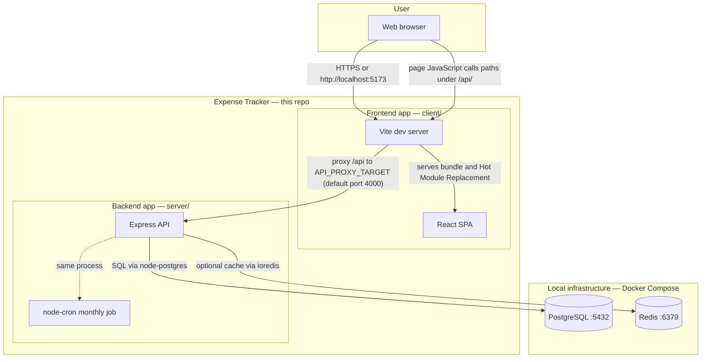

**Integrations described by this diagram:**

| From | To | Protocol or mechanism |
|------|-----|----------------------|
| Browser | Vite | Hypertext Transfer Protocol for HTML, JavaScript, and style sheets; WebSocket for Hot Module Replacement during development |
| Browser (via Vite) | Express | Hypertext Transfer Protocol REST calls; paths beginning with `/api` are forwarded by Vite to the API port |
| Express | PostgreSQL | Transmission Control Protocol using `DATABASE_URL`; Structured Query Language queries |
| Express | Redis | Transmission Control Protocol using `REDIS_URL`; optional caching |
| Express | Google, GitHub, GitLab, or Microsoft | OAuth 2.0: browser redirects and HTTPS calls to token and profile endpoints; the redirect URL is registered on the same origin as the single-page application, and `/api` requests reach Express through the Vite proxy during development |

---

## 1b. From development to production (topology)

**Section 1** above shows **development**: Vite plus Express. **After** you run **`npm run build`** in the client and deploy, the **Vite development server is not part of production**. The browser loads **static files** from the **`dist/`** output directory, and a network **edge** (reverse proxy, content delivery network, or host) routes requests whose path begins with **`/api`** to **Express**.

The small diagram below shows the **order of stages**: first development, then a production build that writes `dist/`, then a production deployment.

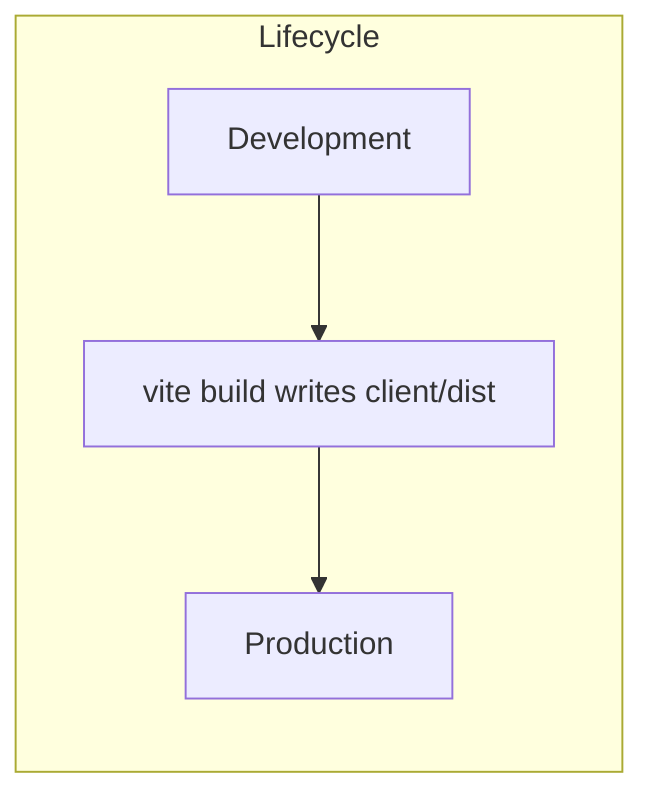

**Development (typical local machine):**

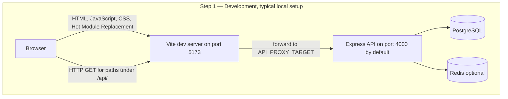

**Production (after build and deploy):**

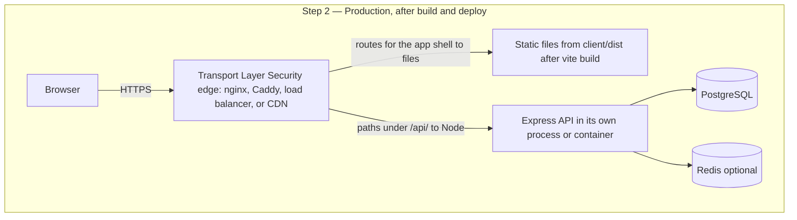

| Stage | What runs |
|-------|-------------|
| **Step 1 — Development** | The Vite development server with Hot Module Replacement; the browser uses the same origin for `/api`, which Vite forwards to Express; often plain HTTP on `localhost`. Typical commands: `npm run dev` in the `client` directory and `npm run dev` in the `server` directory. |
| **Step 2 — Production** | Run `npm run build` in the `client` directory, then serve the **`client/dist/`** directory (the Vite development process does not run in production). Express runs behind Transport Layer Security; `/api` is reached through the edge or via Cross-Origin Resource Sharing if the static site and API use different origins. Set `NODE_ENV=production` (or your host’s equivalent) for the API process. **Concrete bundle:** **`deployment/docker-compose/`** builds **`dist/`** inside the **web** image, runs **nginx** plus the **api** container, and exposes one HTTP port. From the repo root, **`npm run compose:prod`** runs **`ensure-env.mjs`** then **`docker compose up`** (see **deployment/docker-compose/README.md**). |

More detail: [ARCHITECTURE.md — From development to production](./ARCHITECTURE.md#from-development-to-production).

---

## 2. Runtime: manual npm or PM2 (during development)

There are two common ways to run the **same** logical applications (`expense-client` and `expense-api`) while you are developing. The databases are the same in both cases.

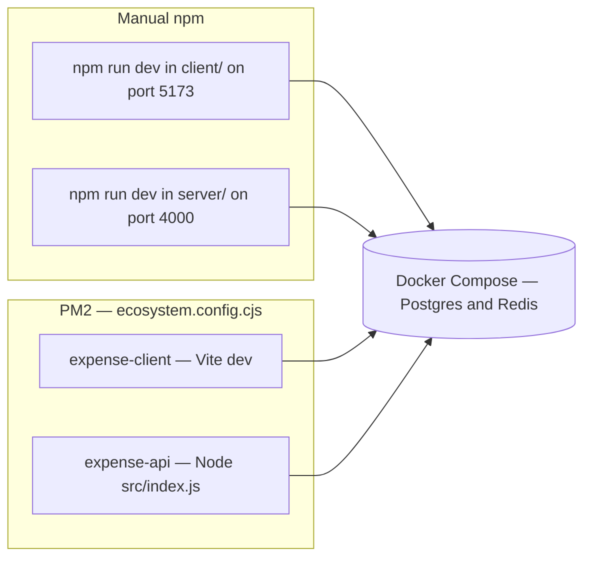

- **Manual two-terminal workflow:** Run the client and server in separate shells. The Vite proxy target must match the API **`PORT`**; set **`API_PROXY_TARGET`** in `client/.env` accordingly.  
- **PM2 workflow:** Both processes are started from the repository root; logs go under `logs/`. Other PM2-managed applications on the same machine share the same PM2 daemon but are separate registered apps.

---

## 3. Backend application — modules and integrations

This diagram shows everything that runs inside the **Express** process and how it connects to libraries and data stores.

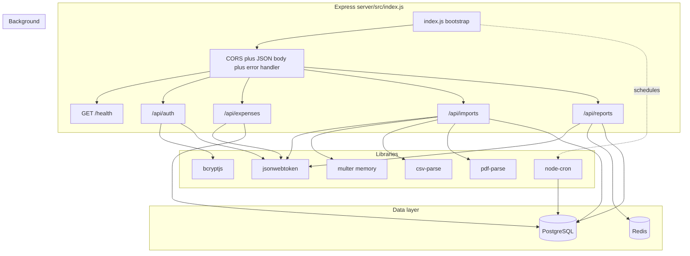

| Module file | Role | Integrations |
|--------|------|----------------|
| `routes/auth.js` | Registration, login, **`me`**, **`POST /refresh`** (new JWT from expired-but-signed token within grace), **`PATCH /profile`**, recovery **`POST`/`DELETE /recovery-code`** (persists **`recovery_code_ciphertext`** via **`recoveryCodeStorage.js`**), **`POST /recover-password`**, **`POST`/`DELETE /avatar`**, static **`/uploads`** | `bcryptjs`, `jsonwebtoken`, `pg`, `multer`, `crypto`; mounts **`oauth/*`** from `oauth/oauthRoutes.js` |
| `oauth/oauthRoutes.js` together with `oauthService.js` and `oauthState.js` | Single sign-on: authorize and callback | `fetch` to identity providers, `pg` for **`oauth_identities`** |
| `routes/expenses.js` | Expense create, read, update, delete | JSON Web Token middleware, `pg`, `expenseEnums.js` |
| `routes/imports.js` | Upload, staging, commit | JSON Web Token, `multer`, `visaStatement.js` for CSV and PDF, `pg` |
| `routes/reports.js` | Aggregates and chart data | JSON Web Token, `pg`, optional `redis.js` |
| `routes/backup.js` | **`GET /export`**, **`POST /restore`** (append or replace expenses; **`account`** metadata, optional **`recoveryCode`**; restore cross-account **409** / **`confirmCrossAccountRestore`**) | JSON Web Token, `pg`, `expenseEnums.js`, **`recoveryCodeStorage.js`** |
| `parsers/visaStatement.js` | Parse uploaded statements | `csv-parse/sync`, `pdf-parse` |
| `jobs/monthlySummary.js` | Monthly rollup job | `node-cron`, `pg` writing **`monthly_summaries`** |
| `db.js` | Connection pool and **`initDb()`** | `pg` |
| `recoveryCodeStorage.js` | Encrypt/decrypt recovery plaintext for **`users.recovery_code_ciphertext`**; **`persistRecoveryCodeForUser`** shared by **`auth`** and **`backup`** | `crypto`, `bcryptjs` |
| `middleware/auth.js` | Bearer JSON Web Token to **`req.userId`** | `jsonwebtoken` |
| `ensureJwtSecret.js` | Persist stable **`JWT_SECRET`** | filesystem write to `server/.env` |

---

## 4. Frontend application — pages and API surface

This diagram shows how **React** pages map to backend routes. The HTTP client uses Axios with `baseURL: "/api"`.

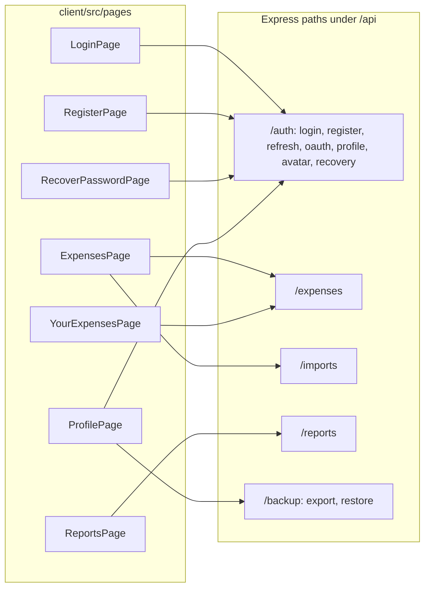

### Renewal reminders (client)

**Upcoming renewals** are computed entirely in the browser from saved expenses (no dedicated API). **`Layout`** always renders **`RenewalReminders`** above the page **`Outlet`** on every authenticated shell route (**`/expenses`**, **`/expenses/list`**, **`/reports`**, **`/profile`**, and the index redirect). It loads expenses and keeps **`renewalSchedule.js`** in sync with the same **frequency** + **`spent_at`** rules as the server’s derived **`payment_day`** / **`payment_month`**. Matching rows are **grouped by financial institution** (display labels from **`expenseOptions.js`**): each group is a **section** with its own **sortable** **table** (expense, transaction date, amount, **state** (`active` / `cancel`), renews, **Dismiss**), a **Subtotal** footer, then a **Total (all institutions)** bar (**`formatProjectionCurrency`** in **`projection.js`**); both totals sum **active** rows only—**cancel** lines are excluded from amounts. Rows with **`state === cancel`** use **emerald** (green) styling. For about **two weeks** after a renewal date, the **25–40 day** reminder band is suppressed so the row stays off the list until the next charge is closer (**`isEarlyRenewalTierSuppressedAfterRecentOccurrence`** in **`renewalSchedule.js`**). **`Layout`** holds **`renewalTablesExpanded`** and passes it to **`RenewalReminders`**. Whenever eligible renewals exist, **`RenewalReminders`** passes **`onRenewalChipChange`** to **`Layout`** with a **count** and callbacks; **`Layout`** shows an **amber badge** to the **right** of the avatar that **toggles** table visibility, and an **account menu** (avatar **`details`**) with **Profile**, **Upcoming renewals** (to **show** tables or restore after all rows dismissed), and **Sign out**; choosing **Upcoming renewals** can clear **`sessionStorage`** dismiss keys and **`expandPanel`** so the panel reappears.

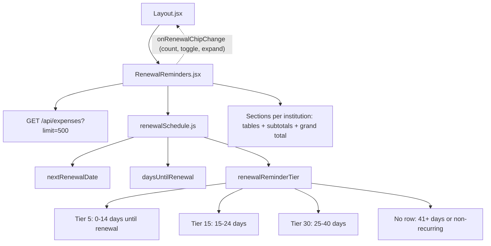

**Day bands** (inclusive, whole local-calendar days from “today” to the next renewal date): **0–14**, **15–24**, **25–40**. They are **contiguous** so counts such as **12** days are not skipped between separate “about 15” and “about 5” windows. **`leadTimePhrase`** in **`RenewalReminders.jsx`** shows “in about 30 days” or “in about 15 days” only when the count is near those anchors; otherwise it uses **“in N days”**.

**Cross-cutting client pieces:**

| Concern | Implementation |
|---------|------------------|
| HTTP client | `api.js` — Axios with `/api` base URL; `Authorization` from `localStorage`; **401 Invalid token** triggers session-expired flow (except auth endpoints such as **`/auth/refresh`**) |
| Authentication state | `auth.jsx` — `AuthProvider`, protected routes, registers the session-invalid handler for `api.js` |
| Expired session prompt | `SessionExpiredModal.jsx` — **Continue session** → **`POST /auth/refresh`** → reload; **Sign out** → **`/login`** |
| Errors | `apiError.js` — network and proxy error messages |
| Labels versus server enums | `expenseOptions.js` — categories, frequencies, institutions, **expense state** (**Active** / **Cancel**; API `active` / `cancel`). **`payment_day`** / **`payment_month`** on expenses are **not** client dropdowns; the API derives them from **`spent_at`**. |
| Upcoming renewals | **`Layout.jsx`** (avatar menu, **badge** toggles tables, **`renewalTablesExpanded`**) + **`RenewalReminders.jsx`** + **`renewalSchedule.js`** — all main shell routes; see [Renewal reminders (client)](#renewal-reminders-client) |
| Single sign-on return route | `OAuthCallbackPage` at `/oauth/callback` — reads the JSON Web Token from the query string after the API redirect; same post-login navigation as email and password |
| Profile and recovery | `ProfilePage` at `/profile` — **`PATCH /auth/profile`**, **`POST`/`DELETE /auth/recovery-code`** (masked UI when **`has_recovery_code`**), **`POST`/`DELETE /auth/avatar`**, **`GET /backup/export`**, **`POST /backup/restore`** (client confirms when backup **`account.email`** differs from session); `RecoverPasswordPage` at `/recover` — **`POST /auth/recover-password`** |

---

## 5. Data model (persistence)

Logical schema owned by the API (PostgreSQL). Redis holds **short-lived** report cache keys only.

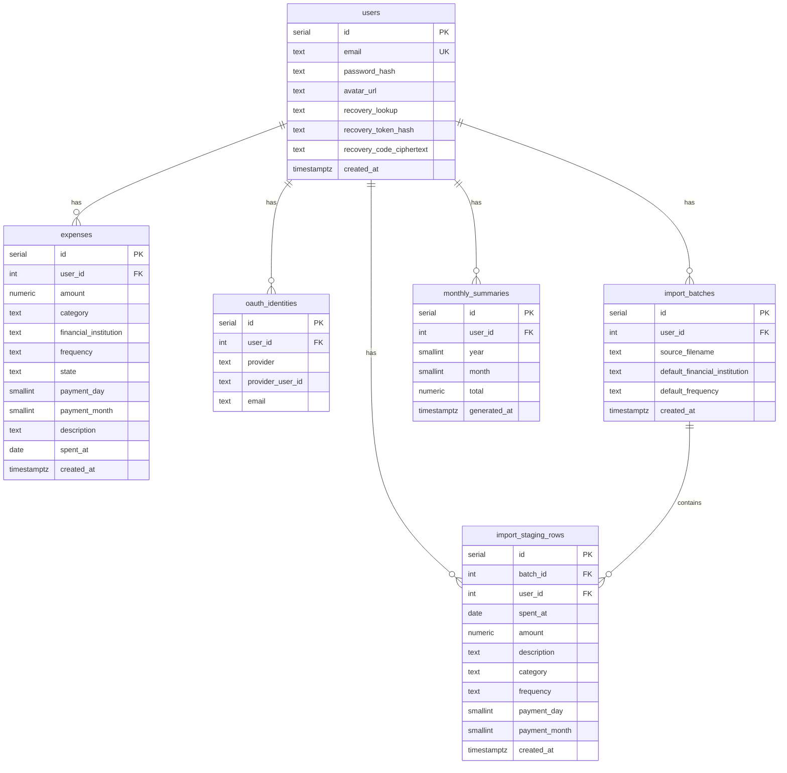

**`expenses.payment_day` / `payment_month`:** Persisted for renewals, imports, and backup JSON; the API always sets them from **`spent_at`** (calendar day of month capped at **30**, month **1–12**). **`POST`/`PATCH /api/expenses`** and **`POST /api/backup/restore`** ignore body values for those columns.

**`expenses.state`:** **`active`** (default) or **`cancel`**, constrained in PostgreSQL. Set on create and update via **`POST`/`PATCH /api/expenses`**; **import commit** inserts **`active`**; **backup** export and restore round-trip **`state`** (restore treats a missing **`state`** as **`active`**).

**`users.recovery_code_ciphertext`:** Optional encrypted copy of the recovery code for **`GET /backup/export`** (see **`recoveryCodeStorage.js`**). **`users.recovery_lookup`** / **`recovery_token_hash`** remain the source of truth for **`POST /recover-password`**.

**Import data flow:** `POST /api/imports` replaces any previous `import_batches` for that user and inserts `import_staging_rows` (with `payment_day` / `payment_month` derived from each line’s `spent_at`). `PATCH /api/imports/rows/:id` may change category or frequency and refreshes `payment_day` / `payment_month` from `spent_at`. `POST /api/imports/batches/:batchId/commit` on a batch moves categorized rows into `expenses` (each new row **`state = active`**) and removes the batch.

---

## 6. Auth sequence (typical protected request)

This sequence shows a **development** setup where the browser talks to Vite first. Vite forwards the request to Express.

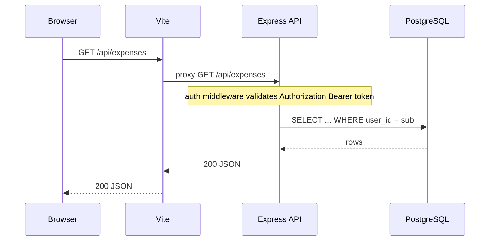

**After you deploy to production**, the first network hop is not Vite: the browser talks to your **edge** server (for example nginx). Requests whose path begins with `/api` (for example `GET /api/expenses`) are forwarded to Express; **`GET /health`** can be proxied the same way (see **`deployment/docker/nginx.conf`**). The single-page application still issues `/api` requests when the static site and API share **one origin** behind that edge.

---

## 7. OAuth single sign-on (redirect flow)

When the user clicks a provider on **Login** or **Register**, this is the high-level flow. The **redirect URI** you register at the identity provider must be `{CLIENT_ORIGIN}/api/auth/oauth/{provider}/callback`. During development, the browser first contacts Vite; Vite proxies to Express. With **deployment Docker Compose**, the browser contacts **nginx** on the published **`HTTP_PORT`**; nginx proxies `/api` to the **api** service (replace **Vite** with **nginx** in the sequence mentally for that topology).

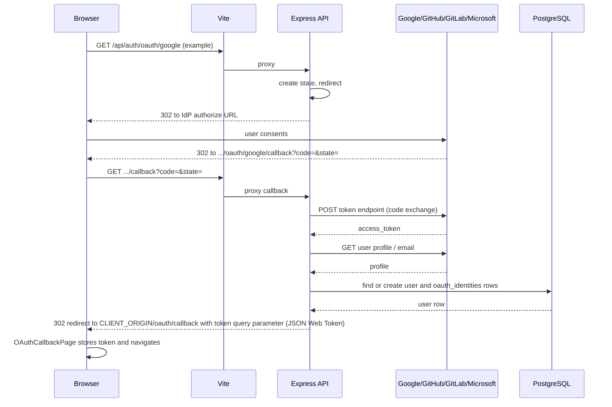

After this flow completes, later API calls follow **section 6** (Bearer JSON Web Token on paths such as `/api/expenses`).

---

## Viewing these diagrams

- **GitHub:** Many Markdown previews render Mermaid diagrams.  
- **Visual Studio Code or Cursor:** Install a Mermaid preview extension if the built-in preview does not render diagrams.  
- **Export:** Copy a diagram into [mermaid.live](https://mermaid.live) to export PNG or SVG.

**Heading anchor identifiers on GitHub:** Links such as `./ARCHITECTURE.md#from-development-to-production` depend on GitHub-generated identifiers for headings. GitHub builds those identifiers using the same rules as the [`github-slugger`](https://github.com/Flet/github-slugger) **`slug()`** function: convert to lowercase, remove punctuation, replace spaces with hyphen characters. Examples used in this repository:

| Heading text in the Markdown file | URL fragment (after the hash) |
|---------|----------|
| `## From development to production` | `from-development-to-production` |
| `## 1b. From development to production (topology)` | `1b-from-development-to-production-topology` |

If you rename a heading, update every link that points to it. If two headings on the same page would produce the same slug, GitHub appends `-1`, `-2`, and so on.

---

[Architecture prose](./ARCHITECTURE.md) — [User guide](./USER_GUIDE.md) — [README: OAuth environment and troubleshooting](../README.md)
