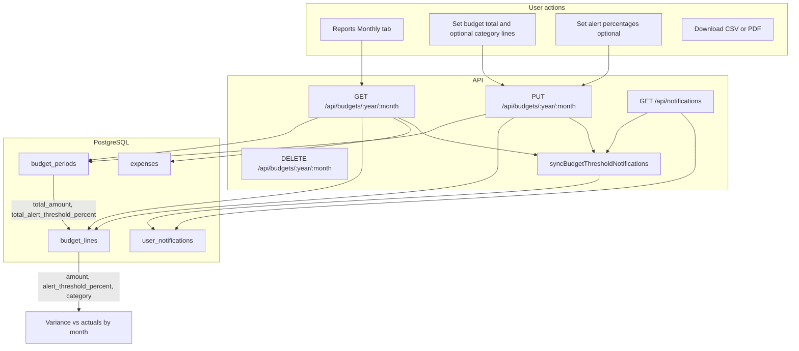
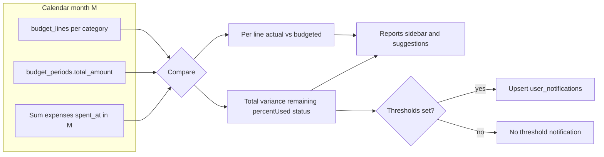

# Budgeting

Standalone guide to **monthly budgets**, **category lines**, **variance**, **threshold notifications**, and **exports**. Diagram sources also live in [`docs/diagrams/`](./diagrams/) as `.mmd` files for editors and [mermaid.live](https://mermaid.live).

---

## What budgeting does

- You set a **monthly total** and optional **per-category caps** for a calendar month.
- The app compares those targets to **actual spending** (expenses with `spent_at` in that month, grouped by category).
- Optional **alert percentages** create **in-app notifications** when total or a line crosses a threshold.
- **Reports → Monthly** shows budget fields, a **composed chart** (budget vs actual), variance, and links to **CSV** and **PDF** exports.

Related but different: **Income vs spend** (cash-flow actuals, recurring run rate, projection) is documented in [INCOME_VS_SPEND.md](./INCOME_VS_SPEND.md).

---

## User flow (high level)

**Diagram file:** [`docs/diagrams/budgeting-overview.mmd`](./diagrams/budgeting-overview.mmd)

---

## How actuals compare to budget

**Diagram file:** [`docs/diagrams/budgeting-vs-actuals.mmd`](./diagrams/budgeting-vs-actuals.mmd)

---

## Data model

| Table | Role |
|--------|------|
| `budget_periods` | One row per `(user_id, year, month)` with `total_amount`, optional `total_alert_threshold_percent`. |
| `budget_lines` | Optional rows: `category`, `amount`, optional `alert_threshold_percent` for that category. |
| `user_notifications` | Rows with **`kind`** **`budget_total_threshold`** or **`budget_category_threshold`** when a threshold is crossed (updated while over threshold via **`dedupe_key`**). |

Schema: [`server/src/db.js`](../server/src/db.js).

---

## API

| Method | Path | Purpose |
|--------|------|---------|
| `GET` | `/api/budgets/:year/:month` | Budget + `byCategory` actuals vs lines + `variance`. |
| `PUT` | `/api/budgets/:year/:month` | Replace period + lines; syncs threshold notifications. |
| `DELETE` | `/api/budgets/:year/:month` | Remove period and lines. |

Implementation: [`server/src/routes/budgets.js`](../server/src/routes/budgets.js).

---

## UI

- **Reports** → **Monthly** tab: month picker, budget editor, chart, variance, export buttons.
- **Notification bell** (header): unread budget-threshold notifications (`budget_total_threshold` / `budget_category_threshold`); mark one read or **Mark all read**.
- Client: [`client/src/pages/ReportsPage.jsx`](../client/src/pages/ReportsPage.jsx), [`client/src/components/NotificationBell.jsx`](../client/src/components/NotificationBell.jsx).

---

## Exports

- **CSV** — monthly report download from Reports (includes budget-related columns where applicable).
- **PDF** — monthly summary via server PDF route (see [ARCHITECTURE.md](./ARCHITECTURE.md) API table).

---

## See also

- [USER_GUIDE.md](./USER_GUIDE.md) — how to use the app end to end.
- [ARCHITECTURE.md](./ARCHITECTURE.md) — modules and API index.
- [INCOME_VS_SPEND.md](./INCOME_VS_SPEND.md) — income, cash flow, and recurring run rate vs obligations.
- Interactive API: **`/api/docs`** (Swagger UI) and **`/api/openapi.json`** — **`/budgets/{year}/{month}`** and **`/notifications`** are described there with other routes.
