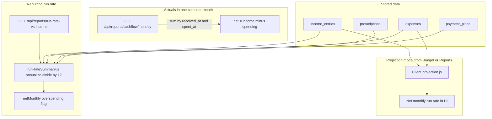
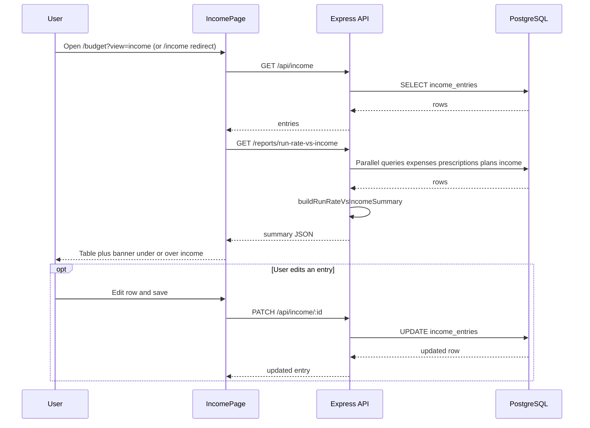

# Income versus spend

Standalone guide to **how income is recorded** and **three different ways** the app compares money in vs money out. Diagram sources: [`docs/diagrams/`](./diagrams/) (`.mmd` files).

**Budgeting** (monthly caps and variance) is a separate concept; see [BUDGETING.md](./BUDGETING.md).

---

## Three comparison modes

| Mode | Question it answers | Primary API / UI |
|------|---------------------|------------------|
| **Cash flow (actuals)** | In this calendar month, how much came in vs went out? | `GET /api/reports/cashflow/monthly` — **Budget** hub **Budget** tab (or **Reports** tab → **Monthly**, or **`/reports`**) |
| **Recurring run rate** | If recurring income and obligations stayed steady, would I be under or over per month? | `GET /api/reports/run-rate-vs-income` — **Income** tab on **`/budget`** (**`IncomePage`** embedded); bookmark **`/income`** redirects to **`/budget?view=income`** |
| **Projection (modal)** | Quick net run rate in the chart tool | Client [`projection.js`](../client/src/projection.js) from **Budget** / **Reports** chart views |

**Diagram file:** [`docs/diagrams/income-vs-spend-overview.mmd`](./diagrams/income-vs-spend-overview.mmd)

---

## Income entries

- **Routes:** Primary UI is the **Income** tab on **`/budget`** (`?view=income`). **`/income`** redirects to **`/budget?view=income`**. **`IncomePage`** is embedded in **`BudgetHubPage`**; list, add, edit, and delete behave the same as before. The **Add entry** form starts **collapsed** (**Show** / **Hide**).
- **Bi-monthly:** two pay days (1–30) are required when frequency is bi-monthly; validated on the server.
- **API:** `GET/POST/PATCH/DELETE /api/income` — [`server/src/routes/income.js`](../server/src/routes/income.js).
- **Table:** `income_entries` — [`server/src/db.js`](../server/src/db.js).
- **Profile backup:** `GET /api/backup/export` includes **`incomeEntries`** when **`version`** is **`4`**; **`POST /api/backup/restore`** with **`replace`** and **`version`** **`4`** replaces **`income_entries`**. See [USER_GUIDE.md](./USER_GUIDE.md) (Backup and restore).

---

## Cash flow (actuals)

- Sums **`income_entries.received_at`** in the selected month vs **expenses** with **`spent_at`** in that month.
- Does **not** use budget lines; it is literal calendar-month totals.
- Used on the **Budget** hub (**Budget** tab and **Reports** → **Monthly**) and standalone **`/reports`** for the cash-flow card / narrative.

---

## Recurring run rate vs income (minimum check)

- **Purpose:** Compare **annualized recurring income** (from `income_entries` with recurring frequencies) to **annualized recurring obligations**: recurring expenses (including renewals), prescriptions, and **payment plans** from `payment_plans` (not double-counting separate `payment_plan` expense rows tied to those plans).
- **Logic:** [`server/src/runRateSummary.js`](../server/src/runRateSummary.js).
- **Endpoint:** `GET /api/reports/run-rate-vs-income` in [`server/src/routes/reports.js`](../server/src/routes/reports.js).
- **UI:** **Income** tab (**`IncomePage`**) loads the summary and shows a banner (no income / no recurring / overspending / OK).

### Sequence: open Income tab (hub)

**Diagram file:** [`docs/diagrams/income-run-rate-sequence.mmd`](./diagrams/income-run-rate-sequence.mmd)

---

## Projection modal

- Uses recurring expense run rate and recurring income run rate to show **net monthly** in the chart dialog on **Budget** / **Reports** views.
- Implementation: [`client/src/projection.js`](../client/src/projection.js).

---

## Legacy doc pointer

Detailed narrative that previously lived in one file is split for clarity:

- **This file** — income vs spend modes and diagrams.
- [BUDGETING.md](./BUDGETING.md) — monthly budget caps and notifications.

The older filename [INCOME_AND_MINIMUM_CHECK.md](./INCOME_AND_MINIMUM_CHECK.md) now points here to avoid duplicate maintenance.

---

## See also

- [USER_GUIDE.md](./USER_GUIDE.md)
- [ARCHITECTURE.md](./ARCHITECTURE.md)
- **`/api/docs`** (Swagger UI) and **`/api/openapi.json`** — **`/income`**, **`/reports/cashflow/monthly`**, **`/reports/run-rate-vs-income`**, and related schemas.
