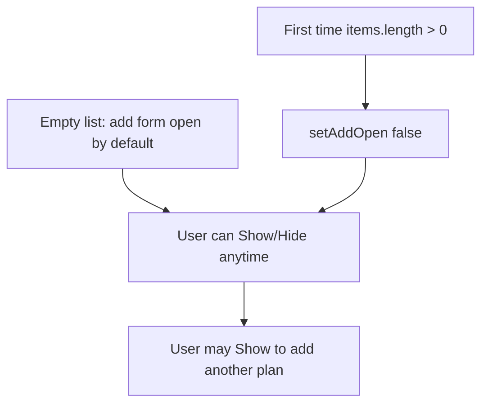
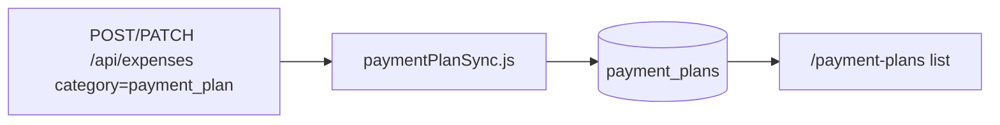

# Payment plans feature

This document describes the **Payment Plan** area: planned payments stored in **`payment_plans`**, the **`/payment-plans`** screen, and synchronization from **`expenses`** when **`category`** is **`payment_plan`**. For system design, see [ARCHITECTURE.md](./ARCHITECTURE.md) and [ARCHITECTURE_DIAGRAM.md](./ARCHITECTURE_DIAGRAM.md). For usage, see [USER_GUIDE.md](./USER_GUIDE.md) (Payment Plan screen).

---

## Concepts

| Idea | Meaning |
|------|---------|
| **Payment plan row** | A row in **`payment_plans`** owned by a user. Fields include **`name`**, **`amount`**, **`category`**, **`payment_schedule`**, **`priority_level`**, **`status`**, **`account_type`**, **`payment_method`**, **`institution`**, **`tag`**, **`frequency`**, **`notes`**, optional **`source_expense_id`**. Allow-lists live in **`server/src/paymentPlanEnums.js`**; labels in **`client/src/paymentPlanOptions.js`**. |
| **Expense category `payment_plan`** | An **`expenses`** row with **`category = payment_plan`** is kept in sync with **`payment_plans`** via **`paymentPlanSync.js`** (linked by **`source_expense_id`**). That row does **not** appear on **`/expenses/list`**; it is represented on **Payment Plan** alongside standalone **`payment_plans`** rows. |
| **Payment Plan page** | Client route **`/payment-plans`** (`PaymentPlansPage.jsx`). Full CRUD via **`GET`/`POST`/`PATCH`/`DELETE /api/payment-plans`**. Table header: **Search notes**, **Projection** (row or all), **update flash** after successful saves. **RowActionsMenu** for **Edit** / **Delete** / **Projection**. |
| **Add payment plan card** | Collapsible inline form under **Add payment plan**. **Show** / **Hide** always toggles visibility of the form. Default **`addOpen`** is **true** when the list is empty. A **`useEffect`** on **`items.length`** uses **`hadItemsRef`**: on the **first** transition to **`items.length > 0`** (initial load with data or first successful add), **`addOpen`** is set to **`false`** so the add block collapses. **Deleting all** plans resets the ref so the next “first non-empty” transition collapses again. |

---

## User flows

### Add section (Show / Hide and auto-collapse)

### Expense category Payment Plan → table sync

---

## API summary

| Method | Path | Notes |
|--------|------|--------|
| **GET** | `/api/payment-plans?limit=` | Lists rows for **`req.userId`**, ordered by **`id`**. Default limit **200**, max **500**. |
| **GET** | `/api/payment-plans/:id` | Single row; **404** if missing or wrong user. |
| **POST** | `/api/payment-plans` | Body fields validated against **`paymentPlanEnums.js`**. **JSON Web Token required**. |
| **PATCH** | `/api/payment-plans/:id` | Partial updates. |
| **DELETE** | `/api/payment-plans/:id` | Removes row. |

**Expenses:** Creating or updating an expense with **`category`** **`payment_plan`** upserts or clears the linked **`payment_plans`** row via **`source_expense_id`** (see **`server/src/paymentPlanSync.js`** and **`server/src/routes/expenses.js`**).

---

## Related files

| Concern | Location |
|---------|----------|
| Payment plan CRUD | `server/src/routes/paymentPlans.js` |
| Enums / validation | `server/src/paymentPlanEnums.js` |
| Expense ↔ plan sync | `server/src/paymentPlanSync.js` |
| Client page | `client/src/pages/PaymentPlansPage.jsx` |
| Options / formatters | `client/src/paymentPlanOptions.js` |

---

[Architecture](./ARCHITECTURE.md) — [User guide](./USER_GUIDE.md) — [Diagrams](./ARCHITECTURE_DIAGRAM.md)
