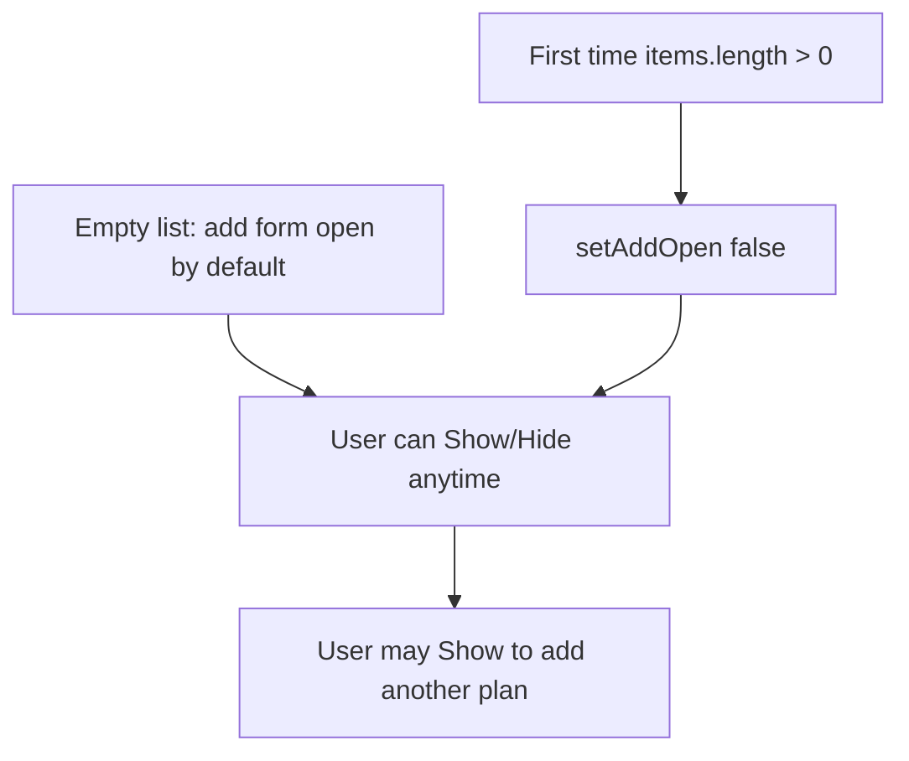
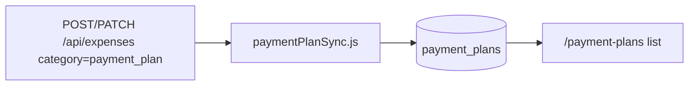
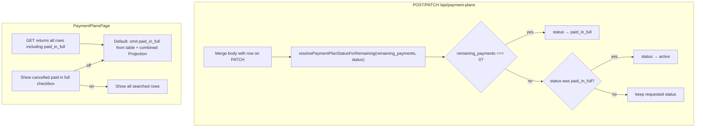
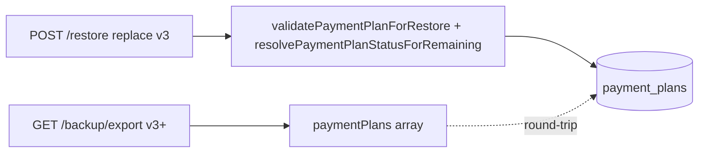

# Payment plans feature

This document describes the **Payment Plan** area: planned payments stored in **`payment_plans`**, the **`/payment-plans`** screen, and synchronization from **`expenses`** when **`category`** is **`payment_plan`**. For system design, see [ARCHITECTURE.md](./ARCHITECTURE.md) and [ARCHITECTURE_DIAGRAM.md](./ARCHITECTURE_DIAGRAM.md). For usage, see [USER_GUIDE.md](./USER_GUIDE.md) (Payment Plan screen).

---

## Concepts

| Idea | Meaning |
|------|---------|
| **Payment plan row** | A row in **`payment_plans`** owned by a user. Fields include **`name`**, **`amount`**, **`category`**, **`payment_schedule`**, **`priority_level`**, **`status`**, **`account_type`**, **`payment_method`**, **`institution`**, **`tag`**, **`frequency`**, optional **`remaining_payments`** (non-negative integer: payments left before the plan is paid off; **`null`** if not set or ongoing), **`notes`**, optional **`source_expense_id`**. Allow-lists live in **`server/src/paymentPlanEnums.js`**; labels in **`client/src/paymentPlanOptions.js`**. |
| **`paid_in_full` status** | When **`remaining_payments`** is **`0`**, the API sets **`status`** to **`paid_in_full`** (treated as finished). If **`remaining_payments`** is not **`0`** (including **`null`**) while **`status`** is **`paid_in_full`**, the API normalizes **`status`** to **`active`**. Restore (**`backup.js`**) applies the same rule when importing rows. |
| **Hidden finished plans (UI)** | On **`PaymentPlansPage`**, rows with **`status === paid_in_full`** are **hidden** by default so the table shows active work. A **Show cancelled (paid in full)** checkbox reveals them for view, edit, delete, and row-level **Projection**. **Combined Projection** and the **Projection** button use only **visible** rows (respects the checkbox). The add form does not offer **`paid_in_full`** as a manual status; it is set by the server when **`# of payments`** reaches zero. |
| **Expense category `payment_plan`** | An **`expenses`** row with **`category = payment_plan`** is kept in sync with **`payment_plans`** via **`paymentPlanSync.js`** (linked by **`source_expense_id`**). That row does **not** appear on **`/expenses/list`**; it is represented on **Payment Plan** alongside standalone **`payment_plans`** rows. |
| **Payment Plan page** | Client route **`/payment-plans`** (`PaymentPlansPage.jsx`). Full CRUD via **`GET`/`POST`/`PATCH`/`DELETE /api/payment-plans`**. Table header: **Search notes**, **Show cancelled (paid in full)**, **Projection** (row or all; **all** disabled when no visible rows), **update flash** after successful saves. **RowActionsMenu** for **Edit** (opens a **modal** with the same full field grid as **Add payment plan**, pre-filled) / **Delete** / **Projection**. The data table stays read-only. |
| **Add payment plan card** | Collapsible inline form under **Add payment plan**. **Show** / **Hide** always toggles visibility of the form. Default **`addOpen`** is **true** when the list is empty. A **`useEffect`** on **`items.length`** uses **`hadItemsRef`**: on the **first** transition to **`items.length > 0`** (initial load with data or first successful add), **`addOpen`** is set to **`false`** so the add block collapses. **Deleting all** plans resets the ref so the next “first non-empty” transition collapses again. |
| **Backup JSON** | **`GET /api/backup/export`** includes **`paymentPlans`** and **`paymentPlanCount`** when **`version`** ≥ **`3`**. **`POST /restore`** with **`mode`** **`replace`** and **`version`** **`3`** replaces **`payment_plans`** from the file (alongside **expenses** and **prescriptions**). See [USER_GUIDE.md](./USER_GUIDE.md) **Backup and restore**. |

---

## User flows

### Add section (Show / Hide and auto-collapse)

```mermaid
flowchart TD
  E[Empty list: add form open by default]
  E --> SH[User can Show/Hide anytime]
  N[First time items.length > 0]
  N --> C[setAddOpen false]
  C --> SH
  SH --> M[User may Show to add another plan]
```

### Expense category Payment Plan → table sync

```mermaid
flowchart LR
  EX["POST/PATCH /api/expenses category=payment_plan"]
  EX --> SYNC["paymentPlanSync.js"]
  SYNC --> PP[(payment_plans)]
  PP --> UI["/payment-plans list"]
```

### Paid in full (server) and hidden rows (client)

```mermaid
flowchart TB
  subgraph API["POST/PATCH /api/payment-plans"]
    M[Merge body with row on PATCH]
    R["resolvePaymentPlanStatusForRemaining(remaining_payments, status)"]
    M --> R
    R --> Z{"remaining_payments === 0?"}
    Z -->|yes| PIF["status → paid_in_full"]
    Z -->|no| Q{"status was paid_in_full?"}
    Q -->|yes| ACT["status → active"]
    Q -->|no| KEEP["keep requested status"]
  end
  subgraph UI["PaymentPlansPage"]
    L["GET returns all rows including paid_in_full"]
    F["Default: omit paid_in_full from table + combined Projection"]
    T["Show cancelled paid in full checkbox"]
    L --> F
    T -->|on| V["Show all searched rows"]
    T -->|off| F
  end
```

---

## API summary

| Method | Path | Notes |
|--------|------|--------|
| **GET** | `/api/payment-plans?limit=` | Lists rows for **`req.userId`**, ordered by **`id`** (includes **`paid_in_full`**). Default limit **200**, max **500**. |
| **GET** | `/api/payment-plans/:id` | Single row; **404** if missing or wrong user. |
| **POST** | `/api/payment-plans` | Body validated against **`paymentPlanEnums.js`**; persisted **`status`** is resolved with **`remaining_payments`** as above. **JSON Web Token required**. |
| **PATCH** | `/api/payment-plans/:id` | Partial updates; merged row is passed through **`resolvePaymentPlanStatusForRemaining`** so **`remaining_payments`** hitting **0** sets **`paid_in_full`** even if **`status`** was omitted. |
| **DELETE** | `/api/payment-plans/:id` | Removes row. |

**Expenses:** Creating or updating an expense with **`category`** **`payment_plan`** upserts or clears the linked **`payment_plans`** row via **`source_expense_id`** (see **`server/src/paymentPlanSync.js`** and **`server/src/routes/expenses.js`**).

### Backup export and restore (version 3)

```mermaid
flowchart LR
  EXP["GET /backup/export v3+"] --> ARR["paymentPlans array"]
  RST["POST /restore replace v3"]
  VAL["validatePaymentPlanForRestore + resolvePaymentPlanStatusForRemaining"]
  RST --> VAL --> PG[(payment_plans)]
  ARR -.->|round-trip| PG
```

---

## Related files

| Concern | Location |
|---------|----------|
| Payment plan CRUD | `server/src/routes/paymentPlans.js` |
| Enums / validation / **`resolvePaymentPlanStatusForRemaining`** | `server/src/paymentPlanEnums.js` (also **`routes/backup.js`** on restore) |
| Expense ↔ plan sync | `server/src/paymentPlanSync.js` |
| Client page | `client/src/pages/PaymentPlansPage.jsx` |
| Options / formatters (**`PAYMENT_PLAN_STATUS_OPTIONS_FOR_ADD`**, **Cancelled (paid in full)** label) | `client/src/paymentPlanOptions.js` |
| Same UX pattern elsewhere | **Expenses** / **Renewals**: read-only **`ExpenseTable`** + **`ExpenseEditModal`** + **`ManualExpenseFormFields`** (`ManualExpenseForm.jsx`). **Prescriptions**: **`PrescriptionFormFields`** modal on **`PrescriptionsPage.jsx`**. |

---

[Architecture](./ARCHITECTURE.md) — [User guide](./USER_GUIDE.md) — [Diagrams](./ARCHITECTURE_DIAGRAM.md)
