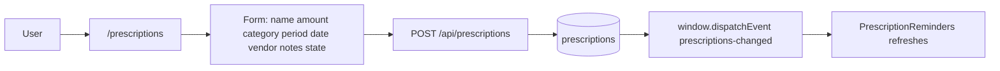
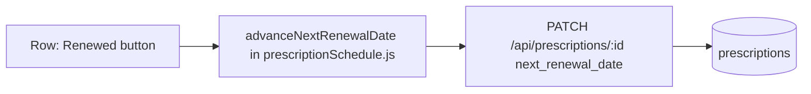
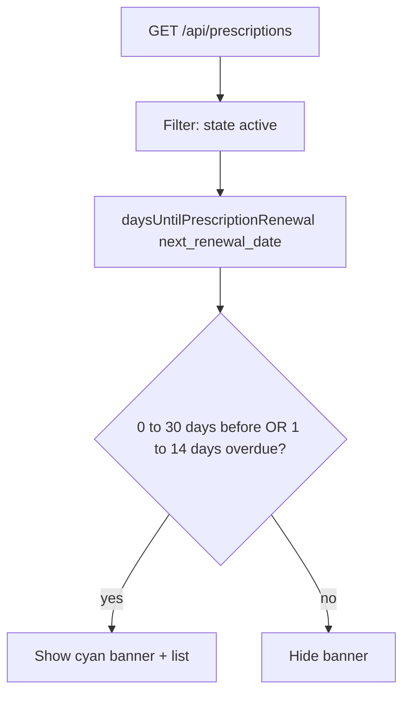

# Prescriptions feature

This document describes the **Prescriptions** area: health-related and supply items (medication refills, dental or vision visits, supplements, equipment) tracked on **irregular renewal cycles** using an explicit **`next_renewal_date`** and **`renewal_period`** (**monthly** steps **1–11 months**, then **1–5 years**), separate from the main **`expenses`** table. For system design, see [ARCHITECTURE.md](./ARCHITECTURE.md) and [ARCHITECTURE_DIAGRAM.md](./ARCHITECTURE_DIAGRAM.md). For usage, see [USER_GUIDE.md](./USER_GUIDE.md).

---

## Concepts

| Idea | Meaning |
|------|---------|
| **Prescription row** | A row in **`prescriptions`** owned by a user. Not an **`expenses`** row. **Import** does not cover prescriptions. **`GET /api/backup/export`** includes **`prescriptions`** when **`version`** ≥ **`2`** (current **`version`** **`3`**); each row’s **`state`** in JSON matches the database via **`normalizePrescriptionStateForBackup`**. **`POST /api/backup/restore`** restores them when the file **`version`** ≥ **`2`** (see [USER_GUIDE.md](./USER_GUIDE.md) **Backup and restore**). |
| **Category** | One of **`medical`**, **`dental`**, **`vision`**, **`supplements`**, **`equipment`** (allow-list in **`prescriptionEnums.js`**). |
| **`renewal_period`** | How long one cycle lasts: **`one_month`** … **`eleven_months`**, then **`one_year`** … **`five_years`** (see **`PRESCRIPTION_RENEWAL_PERIODS`**). **Renewed** adds that many calendar months or years to **`next_renewal_date`** (client **`advanceNextRenewalDate`**). |
| **`next_renewal_date`** | **`DATE`** — next refill, appointment, or reorder target. The client computes **days until** in local calendar math (**`prescriptionSchedule.js`**). |
| **State** | Same semantics as expenses: **`active`** (default), **`paused`**, or **`cancelled`**. Non-**active** rows are omitted from the **30-day reminder** banner. |
| **Prescriptions page** | Client route **`/prescriptions`** (`PrescriptionsPage.jsx`). Full CRUD via **`/api/prescriptions`**. |
| **Prescription reminders** | **`PrescriptionReminders.jsx`** in **`Layout`**, above the page outlet. Fetches **`GET /api/prescriptions`**, shows a cyan banner when any **active** row is due within **30 days** or **1–14 days overdue**. In-app only (no email). Dispatches / listens for **`prescriptions-changed`** after saves so the banner refreshes. |

---

## Fields (API and UI)

| Field | Type | Notes |
|--------|------|--------|
| **name** | string | Required; short label (medication, lenses, device). |
| **amount** | number | Non-negative; cost reference for the cycle. |
| **renewal_period** | enum | See **`PRESCRIPTION_RENEWAL_PERIODS`** in **`server/src/prescriptionEnums.js`**. |
| **next_renewal_date** | `YYYY-MM-DD` | Required on create/update when set. |
| **vendor** | string | Pharmacy, clinic, supplier (optional empty string). |
| **notes** | string | Free text. |
| **category** | enum | **medical**, **dental**, **vision**, **supplements**, **equipment**. |
| **state** | `active` \| `paused` \| `cancelled` | Mirrors expense **State** in the UI. |

---

## User flows

### Add and list

### Mark renewed (advance next date)

**`advanceNextRenewalDate`** adds **N** calendar months for **`one_month`** … **`eleven_months`**, or **N** years for **`one_year`** … **`five_years`**.

### Reminder window (client)

---

## API summary

| Method | Path | Notes |
|--------|------|--------|
| **GET** | `/api/prescriptions?limit=` | Lists rows for **`req.userId`**, ordered by **`next_renewal_date`**, then **`id`**. Default limit **200**, max **500**. |
| **GET** | `/api/prescriptions/:id` | Single row; **404** if missing or wrong user. |
| **POST** | `/api/prescriptions` | Body: **`name`**, **`amount`**, **`renewal_period`**, **`next_renewal_date`**, **`vendor`**, **`notes`**, **`category`**, optional **`state`**. **JSON Web Token required**. |
| **PATCH** | `/api/prescriptions/:id` | Partial update; same validation for any field sent. |
| **DELETE** | `/api/prescriptions/:id` | **204** on success. |

Allow-lists: **`server/src/prescriptionEnums.js`**. Labels: **`client/src/prescriptionOptions.js`**.

---

## Database (persistence)

Table **`prescriptions`** (created in **`server/src/db.js`**):

| Column | Type |
|--------|------|
| **`id`** | `SERIAL PK` |
| **`user_id`** | `FK → users` |
| **`name`** | `TEXT NOT NULL` |
| **`amount`** | `NUMERIC(12,2) CHECK >= 0` |
| **`renewal_period`** | `TEXT NOT NULL` |
| **`next_renewal_date`** | `DATE NOT NULL` |
| **`vendor`**, **`notes`**, **`category`** | `TEXT` |
| **`state`** | `active` \| `paused` \| `cancelled` (check constraint) |
| **`created_at`** | `TIMESTAMPTZ` |

Index: **`(user_id, next_renewal_date)`**.

See the entity-relationship figure in [ARCHITECTURE_DIAGRAM.md § Data model](./ARCHITECTURE_DIAGRAM.md#5-data-model-persistence).

---

## Related source files

| Area | Location |
|------|-----------|
| Enums and date parsing | `server/src/prescriptionEnums.js` |
| CRUD routes | `server/src/routes/prescriptions.js` |
| Table DDL | `server/src/db.js` |
| Mount **`/api/prescriptions`** | `server/src/index.js` |
| Prescriptions page | `client/src/pages/PrescriptionsPage.jsx` |
| Reminder banner | `client/src/components/PrescriptionReminders.jsx` |
| Labels | `client/src/prescriptionOptions.js` |
| Day math + advance date | `client/src/prescriptionSchedule.js` |
| Nav + shell | `client/src/components/Layout.jsx` — **Import**; **Lists** ▾ below **`lg`** or inline **Expenses** / **Renewals** / **Prescriptions** / **Reports** at **`lg`**+ |
| Route **`/prescriptions`** | `client/src/App.jsx` |

---

## Where to go next

- [USER_GUIDE.md](./USER_GUIDE.md) — Prescriptions screen  
- [ARCHITECTURE.md](./ARCHITECTURE.md) — Client and server overview  
- [ARCHITECTURE_DIAGRAM.md](./ARCHITECTURE_DIAGRAM.md) — Diagrams and ER model  
