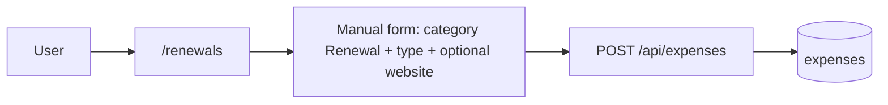
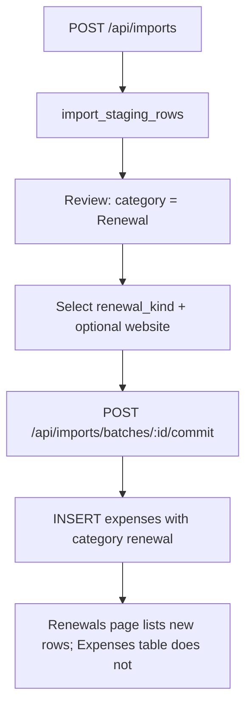
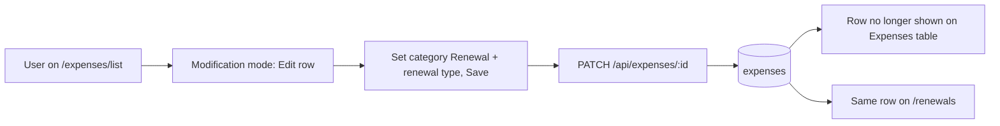

# Renewals feature

This document describes the **Renewals** product area: long-horizon or irregular renewals (annual fees, multi-year contracts, domain names, **online education** memberships or tuition cycles, and similar) modeled as **expenses** with a dedicated **category** and **renewal type**. For how the app is built, see [ARCHITECTURE.md](./ARCHITECTURE.md) and [ARCHITECTURE_DIAGRAM.md](./ARCHITECTURE_DIAGRAM.md). For day-to-day use, see [USER_GUIDE.md](./USER_GUIDE.md) (Import and Renewals sections).

---

## Concepts

| Idea | Meaning |
|------|---------|
| **Renewal row** | A row in **`expenses`** with **`category = renewal`**. It uses the same core fields as any expense (amount, **`spent_at`**, frequency, institution, state, note). |
| **`renewal_kind`** | Required when **`category`** is **`renewal`**. An allow-listed subtype (for example **`domain_names`**, **`car_insurance`**, **`online_education`**, **`hoa_fees`**). Stored in **`expenses.renewal_kind`** and mirrored on **`import_staging_rows`** during import review. |
| **`website`** | Optional text (portal or URL) stored in **`expenses.website`**. On **commit**, **`website`** and **`renewal_kind`** are only copied from staging when the row’s category is **`renewal`**. |
| **Renewals page** | Client route **`/renewals`** (`RenewalsPage.jsx`). Lists **`GET /api/expenses?category=renewal`**. Same **`ExpenseTable`** patterns as **Expenses** (sort, sticky **Actions** column, **Projection** / **Edit** / **Delete** in the row menu). **Projection:** header opens **combined** totals for **Active** rows only; row **Projection** opens a single-row modal. **`state`** **`cancel`** is excluded from combined projection math (aligned with **Upcoming renewals** subtotals). |
| **Expenses list** | Client route **`/expenses/list`** (`YourExpensesPage.jsx`) loads **`GET /api/expenses`** but **does not list** rows whose **`category`** is **`renewal`**; those are exclusive to this Renewals page in the UI. Changing category **to** **`renewal`** on the Expenses page (with a valid **`renewal_kind`**) removes the row from that list after save. |
| **Upcoming renewals** (banner) | Separate client feature: **`RenewalReminders`** uses **`GET /api/expenses?limit=500`** and **frequency** + **`spent_at`** math. It is **not** limited to **`category = renewal`**—any recurring expense can appear there. |

---

## User flows

### Add a renewal from the Renewals page

### Import statement lines as renewals

**Commit rules:** A staging row is imported only if it has a **category** and, when category is **`renewal`**, a non-null **`renewal_kind`**. Rows marked **Renewal** without a type are skipped (same “not ready” bucket as uncategorized rows in the UI).

### Change category to Renewal from the Expenses list

### Backup and restore

Renewal rows are included in **`expenses`** in the JSON backup. Each object may include **`website`** and **`renewal_kind`**. Restore validates: if **`category`** is **`renewal`**, **`renewal_kind`** must be present and valid.

---

## API summary

| Method | Path | Notes |
|--------|------|--------|
| **GET** | `/api/expenses?category=renewal&limit=500` | Lists renewal rows for the signed-in user. Other query params (**`from`**, **`to`**, **`offset`**) behave like the general list. |
| **POST** | `/api/expenses` | Body may include **`renewal_kind`** (required if **`category`** is **`renewal`**) and optional **`website`**. |
| **PATCH** | `/api/expenses/:id` | Updating **`category`** away from **`renewal`** clears **`renewal_kind`**. Switching **to** **`renewal`** requires **`renewal_kind`** in the same request if the row had none. |
| **PATCH** | `/api/imports/rows/:id` | May set **`category`**, **`renewal_kind`**, **`website`**, **`frequency`**. Setting category to something other than **`renewal`** clears **`renewal_kind`** on the server. |

Allow-lists live in **`server/src/expenseEnums.js`** (`CATEGORIES`, **`RENEWAL_KINDS`**) and are mirrored for labels in **`client/src/expenseOptions.js`** (**`RENEWAL_KIND_OPTIONS`**).

**Combined Projection (client):** The API does not filter by **State** for **`GET /api/expenses?category=renewal`**. The Renewals page **`Projection`** modal passes only rows with **`state !== cancel`** into **`projection.js`** helpers so run rates and the pie match **Active** renewal spend (aligned with **Upcoming renewals** subtotals).

### Renewal type catalog

The **authoritative** list of valid **`renewal_kind`** strings is **`RENEWAL_KINDS`** in **`server/src/expenseEnums.js`**, with human-readable labels in **`RENEWAL_KIND_OPTIONS`** in **`client/src/expenseOptions.js`**. New product types (for example **Online education**, API value **`online_education`**) are added there so the API, import, backup restore, and UI stay aligned. The dropdowns on **Import**, **Expenses**, and **Renewals** always reflect that list.

---

## Database (persistence)

Renewal-specific columns (additive migrations in **`server/src/db.js`**):

| Table | Columns |
|-------|---------|
| **`expenses`** | **`website`** `TEXT NULL`, **`renewal_kind`** `TEXT NULL` |
| **`import_staging_rows`** | **`website`** `TEXT NULL`, **`renewal_kind`** `TEXT NULL` |

Logical relationship: renewal rows are still **`expenses`**; there is no separate **`renewals`** table. See the **entity-relationship** figure and **import pipeline** / **backup** flowcharts in [ARCHITECTURE_DIAGRAM.md § Data model](./ARCHITECTURE_DIAGRAM.md#5-data-model-persistence).

---

## Related source files

| Area | Location |
|------|-----------|
| Server enums and parsers | `server/src/expenseEnums.js` |
| Expense CRUD + list filter | `server/src/routes/expenses.js` |
| Staging PATCH + commit | `server/src/routes/imports.js` |
| Backup export/restore fields | `server/src/routes/backup.js` |
| Renewals page | `client/src/pages/RenewalsPage.jsx` — filters **`cancel`** before combined Projection |
| Expenses list (non-renewal UI filter) | `client/src/pages/YourExpensesPage.jsx` |
| Import UI (renewal columns) | `client/src/pages/ExpensesPage.jsx` |
| Shared table + renewal columns | `client/src/components/ExpenseTable.jsx` — optional **`onRowProjection`** (passed on **`YourExpensesPage`**, not **`RenewalsPage`**) |
| Manual form (renewal fields) | `client/src/components/ManualExpenseForm.jsx` |
| Nav link | `client/src/components/Layout.jsx` |
| Route registration | `client/src/App.jsx` |

---

## Where to go next

- [USER_GUIDE.md](./USER_GUIDE.md) — Import screen, Renewals screen, categories  
- [ARCHITECTURE.md](./ARCHITECTURE.md) — Routing and data model narrative  
- [ARCHITECTURE_DIAGRAM.md](./ARCHITECTURE_DIAGRAM.md) — ER diagram and frontend/API map  
